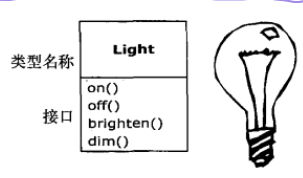
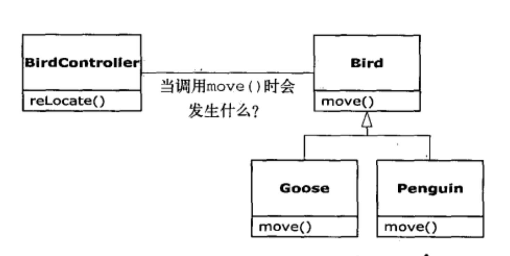

# 第01章 对象导论
本章主要讨论面向对象的程序设计(Object-Oriented Programming, OOP)的基本思想、特点与相关注意事项。
## 1-1. 抽象
可以认为，人们能够解决的问题的复杂性取决于抽象的**类型**和**质量**，类型是指“所抽象的是什么”，汇编是对机器的轻微抽象，后面出现了例如fortran,c 等命令式语言，它们在解决问题时基于计算机的结构，程序员必须建立起在机器模型（**解空间**，例如计算机）和问题模型（**问题空间**，例如某业务）之间的联系。  
面向对象方式是针对问题进行建模，他将问题空间中的元素及其在解空间的表示抽象为对象，OOP允许根据问题本身对问题进行描述，Alan Kay(Smalltalk第一个成功的面向对象语言的设计者)提出了面向对象程序设计方式的五个特点：
* 万物皆对象  
* 程序是对象的集合，它们之间**通过收发消息（对特定对象的方法调用，请求）来完成交流**  
* 可以通过创建包含现有对象的包的方式创建新对象  
* 每个对象都有自己的类型，或者说是个类的实例  
* 某一类型的对象可以接收同样的消息  
## 1-2. 接口
类描述了具有相同特性（数据元素）和行为（功能、方法）的对象集合，因此类实际上就是一个数据类型，**面向对象程序设计的挑战之一就是在问题空间的元素和解空间的对象之间创建一对一的映射**（也就是针对具体问题分析有哪些元素，各自完成什么功能），接口确定对某一特定对象所能发出的请求，或者说接口定义了某一类型的对象所能够完成的请求。
  
如上图，可以向类型为Light的对象发出的请求包括：打开、关闭、调亮、调暗等。
## 1-3. 对象是服务提供者
对象这种观念，本身就是十分方便的工具，使得你可以通过概念将数据和功能封装到一起。将对象想象为服务提供者，程序本身需要向用户提供服务，这将通过调用其他对象的服务进行实现，这些对象可以从现有代码库寻找或者是去创建，针对具体问题，不断追问“什么样的对象可以立即解决这个问题呢？”，**将问题分解为对象的集合，创建或寻找能提供理想服务的对象**。
什么是理想的服务，一个主要特点是他具备**高的内聚性**，他很好的完成一项任务而不试图左更多的事。
## 1-4. 隐藏实现与权限控制
程序开发者分为类创建者和客户端使用者，客户端程序员的目标是收集种用来实现快速应用开发的类，类创建者的目标是构建类，这种类只向客户端程序员暴露必需的部分，而隐藏其他部分。
其一是**隐藏具体实现细节**，客户端程序员只需要知道类的功能和使用方法即可，不需要考虑其如何实现。
其二是**权限控制**，类创建者希望隐藏类的一部分使其不会被轻易破坏，同时可以修改其实现而不影响使用者的使用。
Java用三个关键字在类的内部设定边界:**public、private、protected**。这些访问指定词(access specifier)决定了紧跟其后被定义的东西可以被谁使用。public表示紧随其后的元素对任何人都是可用的，而private这个关键字表示除类型创建者和类型的内部方法之外的任何人都不能访问。protected关键字与private作用相当，差别仅在于继承的类可以访问protected成员。
## 1-5. 对象的复用——组合与继承
一个编写完成的类应该代表一个有用的代码单元。它具有良好的复用性，例如创建一个对象，被**组合（composition）**到一个新类．如果组合是动态发生的，称为聚合（aggregation）。组合视为has －a关系，例如汽车拥有引擎。
**继承**包含基类与导出类两个概念，导出类复制基类（所有可以发送给基类对象的消息同时也可以发送给导出类对象）并添加新特性（这可以通过直接添加或者**重写或称覆盖(overriding)**完成），注意基类的变化会导致导出类的变化．

组合带来了极大的灵活性，**新类的成员对象通常都被声明为private**，使得使用新类的客户端程序员不能访问它们。继承并不具备这样的灵活性，因为编译器必须对通过继承而创建的类施加编译时的限制。由于继承在面向对象程序设计中如此重要，所以它经常被高度强调，于是程序员新手就会有这样的印象:处处都应该使用继承。这会导致难以使用并过分复杂的设计。**实际上，在建立新类时，应该首先考虑组合，因为它更加简单灵活**。如果采用这种方式，设计会变得更加清晰旦有了一些经验之后，便能够**看出必须使用继承的场合**了。
## 1-6. 多态--后期绑定与泛化调用
在处理类型的层次结构时，经常想把一个对象不当作它所属的特定类型来对待，而是将其当作其基类的对象来对待。这使得人们可以编写出**不依赖于特定类型的代码**。在“几何形”的例子中，**方法操作的都是泛化 (generic)的形状，而不关心它们是圆形、正方形、三角形还是其他什么尚未定义的形状**。所有的几何形状都可以被绘制、擦除和移动，所以这些方法都是直接对一个几何形对象发送消息，它们不用担心对象将如何处理消息。

多态与动态绑定，oop程序直到运行时才能确定代码地址，因此对于一个泛化的函数调用，它是后期绑定的，为此Java需要一段代码计算函数地址
## 1-7. 单根继承结构
是否所有的类都继承自单一的基类？在Java中是的（其他OOP语言也是）。单根继承结构保证所有的对象都具有某些功能和特性。单根继承结构使**垃圾回收器**的实现变得容易得多，而垃圾回收器正是Java相对C++的重要改进之一。由于所有对象都保证具有其类型信息，因此**不会因无法确定对象的类型而陷入僵局，这对于系统级操作(如异常处理)显得尤其重要**，并给编程带来了更大的灵活性。
## 1-8. 容器与泛型
**容器用于存放多个对象，泛型规定了容器中存放对象的类型**(e.g. ArrayList\<Shape\> shapes = new ArrayList\<Shape\>() )，不同的容器提供了不同类型的接口和外部行为，例如堆栈和队列的外部行为不同，同时不同的容器对于某些操作具有不同的效率，例如数组和链表对于随机访问这一操作效率不同，**Java提供了丰富的标准容器**，可以选择使用。
## 1-9. 对象的创建与生命周期
Java完全采用了动态分配内存的方式，在称为堆的内存池中动态的创建对象。在这种方式中，直到运行时才知道有多少对象、对象类型及生命周期等。同时，由于对象的内存空间是在堆上动态分配的，因此需要较多的时间（相对于堆栈，堆栈分配内存只需要移动堆栈指针，向下移动分配空间，向上移动释放空间）。另外由于动态的特性，对象对于编译器是透明的，因而在C++中需要编程确定（delete）——这常常导致内存泄漏，Java是采用**垃圾回收器**机制的，它“自动发现不被使用的对象并予以销毁”
## 1-10. 异常处理
异常处理将错误处理直接置于编程语言中，有时甚至置于操作系统中。异常是一种对象它从出错地点被“抛出”，并被专门设计用来处理特定类型错误的相应的异常处理器“捕获”异常处理就像是与程序正常执行路径并行的、在错误发生时执行的另一条路径。因为它是另一条完全分离的执行路径，所以它不会于扰正常的执行代码。
## 1-11. Java并发编程
有时中断对于处理时间性强的任务是必需的，但是对于大量的其他问题，我们只是想把问题切分成多个可独立运行的部分 (任务)，从而提高序的响应能力。在程序中，这些彼此独立运行的部分称之为线程，上述概念被称为“并发”。并发最常见的例子就是用户界面。**Java的并发是内置于语言中的**。
## 1-12. Java网络编程
&emsp;&emsp;服务器/客户端计算技术：单一的服务器为多个客户服务（分发信息，汇总信息）。通常，这会涉及**数据库管理系统**，因此设计者把数据“均衡”分布于数据表中以取得最优的使用效果。此外，系统通常允许客户在服务器中插入新的信息。这意味着必须保证一个客户插入的新数据不会覆盖另一个客户插人的新数据，也不会在将其添加到数据库的过程中丢失(这被称为**事务处理**)。如果客户端软件发生变化，那么它必须被重新编译、调试并安装到客户端机器上，事实证明这比想像的要更加复杂与费力。如果想**支持多种不同类型的计算机和操作系统**，问题将更麻烦。最后还有一个最重要的**性能问题:可能在任意时刻都有成百上千的客户向服务器发出请求**，所以任何小的延迟都会产生重大影响。为了将延迟最小化，程序员努力减轻处理任务的负载，通常是分散给客户端机器处理，但有时也会使用所谓的中间件将负载分散给在服务器端的其他机器。(中间件也被用来提高可维护性。)
&emsp;&emsp;客户端编程，对于出错的数据并不返回给服务器交给服务器检查后再返回错误报告再进行错误处理，而是在客户端的浏览器进行处理，此时浏览器不再只是一个查看器，它还具有运行程序片段的功能，解决方案例如插件、脚本语言（JavaScript, 解决八成）与Java(剩下的难啃的两成)。另一方面对于服务器编程，通常是涉及到数据库的事务处理，例如用户注册等。
