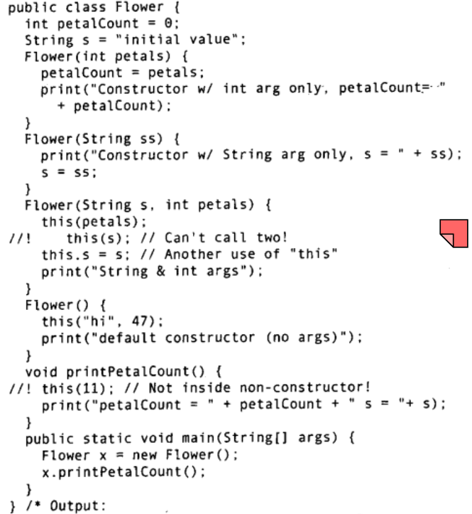

# 第05章 初始化和清理
初始化和清理正是设计安全的两个问题, 许多程序bug正是源于忘记初始化变量, 另外变量使用后不释放会造成资源耗尽
**要点提示**
**1. 构造器与重载**
**2. 初始化顺序**
**3. 对象创建过程**
## 构造器
constructor(), 这是在创建对象时自动调用的方法, 函数名称与类相同, 因此**初始化工作可以在构造函数中完成**, 同其他函数方法一样, 构造函数也可以具有参数列表, 可以重载。
#### 构造函数可以且需要重载
大多数程序设计语言(尤其是C) 要求为每个方法(在这些语言中常称为函数)都提供个独一无二的标识符。所以绝不能用名为print()的函数显示了整数之后，又用一个名为print()的函数显示浮点数一每个函数都要有唯一的名称。

你可以说“清洗衬衫”、“清洗车”、“清洗狗”。但如果硬要这样说就显得很愚蠢:“以洗衬衫的方式洗衬衫”、“以洗车的方式洗车”、“以洗狗的方式洗狗”。在Java (和C++)里，**构造器是强制重载方法名的另一个原因。既然构造器的名字已经由类名所决定，就只能有一个构造器名。那么要想用多种方式创建一个对象该怎么办呢?** 假设你要创建一个类，既可以用标准方式进行初始化，也可以从文件里读取信息来初始化。这就需要两个构造器:一个默认构造器，另一个取字符串作为形式参数 -- 该字符串表示初始化对象所需的文件路径。、
#### 区分重载方法
通过传入不同的参数列表来对各个重载方法进行区分(甚至是不同的参数顺序), 注意不可以通过返回值来进行区分, 另外, 参数类型可能发生**隐含的类型转换**, 例如char转为int(若没有以char为参数的函数)等
#### 再谈构造器--在构造器中调用构造器*this()*
当未编写构造器时, 编译器会自动创建一个默认构造器, 他没有参数列表, 具有一个空的方法体. 但如果人为编写了构造器, 那么编译器就不会再创建默认构造器. 值得注意的是, 构造器可以重载, 没有返回类型, 可以调用其他构造器简化代码, 构造器仅可以被构造器调用，且仅调用一次, 这是通过this关键字实现的。
this关键字指代了当前对象:
```java
public class Leaf {
    int i=0;
    Leaf increment(){
        i++;
        return this;
    }
    void print(){
        System.out.println("i="+ i);
    }
    public static void main(String[] args){
        Leaf x = new Leaf();
        x.increment()increment().increment().print();
    }
}
```
如下图为构造器合法调用示例

```java
/*TODO*/
// 完成上述两个程序
```
#### static关键字
了解this关健字之后，就能更全面地理解static (静态)方的含义。static方法就是没有this的方法。在static方法的内部不能调用非静态方法，反过来倒是可以的。而且可以在没有创建任何对象的前提下，仅仅通过类本身来调用static方法。这实际上正是static方法的主要用途。

## 清理、终结处理和垃圾回收
**这一部分的内容比较晦涩难理解, 内容在书本87页至92页间, 主要讲解了finalize方法, 垃圾回收技术, 存储空间分配机制, 终结条件等内容**
finalize的使用场景: 垃圾回收器只清楚如何释放在堆上分配内存的对象(new 得到), 而假如通过其他语言的嵌入分配了一块特定区域的内存块, 这使得垃圾回收器无法回收这块特殊区域. 为此, Java引入了**finalize()方法, 一旦垃圾回收器准备好释放对象占有的存储空间, 将首先调用其finalize()方法, 然后在下一次垃圾回收动作前真正的释放对象内存。**
注意finalize不同于C++的析构, C++的对象总是会被销毁, 而在Java中对象可能不被垃圾回收, 垃圾回收不等于析构, 垃圾回收仅与内存相关.看来之所以要有finalize()，是由于在分配内存时可能采用了类似C语言中的做法，而非Java中的通常做法。这种情况主要发生在使用“本地方法”的情况下，本地方法是一种在Java中调用非Java代码的方式。本地方法目前只支持C和C++，但它们可以调用其他语言写的代码，所以实际上可以调用任何代码。在非Java代码中，也许会调用C的malloc()函数系列来分配存储空间，而且除非调用了free()函数，否则存储空间将得不到释放，从而造成内存泄露。当然，free()是C和C++中的函数，所以需要在fnalize()中用本地方法调用它。

记住，无论是“垃圾回收”还是“终结”，都不保证一定会发生、如果Java虚拟机(JVM)并未面临内存耗尽的情形，它是不会浪费时间去执行垃圾回收以恢复内存的。通常，不能指望finalize()，必须创建其他的“清理”方法，并且明确地调用它们。看来inalize0只能存在于程序员很难用到的一些晦涩用法里了。不过，fimalize()还有一个有趣的用法它并不依赖于每次都要对finalize()进行调用，这就是对象终结条件的验证

打个比方，你可以把C++里的堆想像成一个院子，里面每个对象都负责管理自己的地盘。一段时间以后，对象可能被销毁，但地盘必须加以重用。在某些Java虚拟机中，堆的实现截然不同:它更像一个传送带，每分配一个新对象，它就往前移动一格。**这意味着对象存储空间的分配速度非常快。Java的“堆指针”只是简单地移动到尚未分配的区域，其效率比得上C++在堆栈上分配空间的效率。**当然，实际过程中在簿记工作方面还有少量额外开销，但比不上查找可用空间开销大。

### 初始化
已经提到, 类内部定义的变量会被自动初始化为默认值, 这被称为自动初始化, 当然也可以自行指定。另外, 还可以在构造器中进行变量初始化。这里就有一些重要的问题需要讨论, 也即**初始化顺序问题**。

另外, 对于static静态域, 它是与类相关的, 而不管程序中是否创建了该类型的对象, 只要类被加载了, 静态域的变量就会被初始化, 他只进行一次。
```java
class Bowl{
    Bowl(int marker){
        print("Bowl(" + marker +")");
    }
    void fl(int marker){
        print("f1("+ marker +")");
    }
}
class Table {
    static Bowl bowll = new Bowl(1);
    Table(){
        print("Table()");
        bowl2.f1(1);
    }
    void f2(int marker){
        print("f2("+ marker +")");
    }
    static Bowl bowl2 = new Bowl(2);
}
class Cupboard {
    Bowl bowl3 = new·Bowl(3);
    static Bowl bowl4 = new Bowl(4);
    Cupboard(){
        print("Cupboard()");
        bowl4.fl(2);
    }
    void f3(int marker){
        print("f3("+ marker +")")；
    }
    static Bowl bowl5=new Bowl(5);
}
public class StaticInitialization {
    public static void main(String[] args) {
        print("Creating new Cupboard() in main");
        new Cupboard();
        print("Creating new Cupboard() in main");
        new Cupboard();
        table.f2(1);
        cupboard.f3(1);
    }
    static Table table = new Table();
    static Cupboard cupboard = new Cupboard();
}
/* 实现上述程序并分析运行结果 */
```

总结一下对象的创建过程，假设有个名为Dog的类:
1.即使没有显式地使用static关键字，构造器实际上也是静态方法。因此，当首次创建类型为Dog的对象时 (构造器可以看成静方法)，或者Dg的静方法/静态域首次被访问时Java解释器必须查找类路径，以定位Dog.class文件。
2.然后加载Dog.class(后面会学到，这将创建一个CIass对象)有关静态初始化的所有动作都会执行。因此，**静态初始化只在Class对象首次加载的时候进行一次**。
3.当用new Dog()创建对象的时候，首先将在堆上为Dog对象分配足够的存储空间. 这块存**储空间会被清零，这就自动地将Dog对象中的所有基本类型数据都设置成了默认值**(对数字来说就是0，对布尔型和字符型也相同)，而用则被设置成了null. 执行所有出现于字段定义处的初始化动作
6.**执行构造器**。正如将在第7章所看到的，这可能会牵涉到很多动作，尤其是涉及继承的时候.
