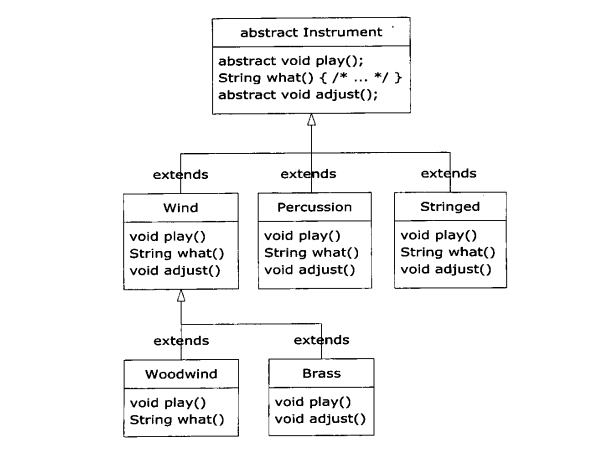
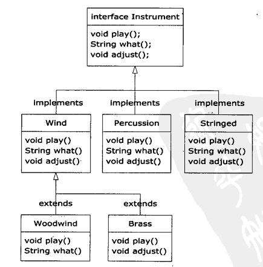
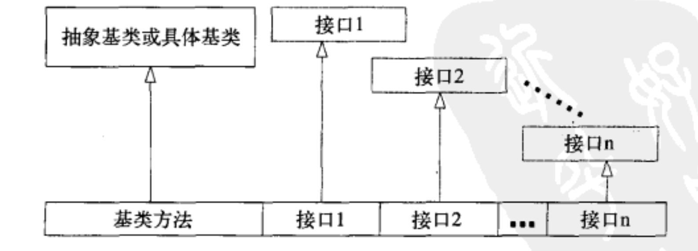

# 第09章 接口
**接口和内部类为我们提供了一种将接口与实现分离的更加结构化的方法**，这种机制在编程语言中并不通用。例如，C++对这些概念只有间接的支持。在Java中存在语言关键字这个事实表明人们认为这些思想是很重要的，以至于要提供对它们的直接支持。首先，我们将学习**抽象类，它是普通的类与接口之间的一种中庸之道**。尽管在构建具有某些未实现方法的类时，你的第一想法可能是创建接口，但是抽象类仍旧是用于此目的的一种重要而必须的工具。因为你不可能总是使用纯接口。

## 9-1 抽象类和抽象方法
在那些示例中，建立这个通用接口的唯一理由是，不同的子类可以用不同的方式表示此接口。**通用接口**建立起一种基本形式，以此**表示所有导出类的共同部分**。另一种说法是将2。**Instrument类称作抽象基类，或简称抽象类**。
为此，Java提供一个叫做**抽象方法**的机制，**这种方法是不完整的，仅有声明而没有方法体**。下面是抽象方法声明所采用的语法:
`abstract void f();`
**包含抽象方法的类叫做抽象类。如果一个类包含一个或多个抽象方法，该类必须被限定为抽象的。(否则，编译器就会报错。)**
我们也可能会**创建一个没有任何抽象方法的抽象类**。考虑这种情况:如果有一个类，让其包含任何abstract方法都显得没有实际意义，而且我们也想要**阻止产生这个类的任何对象**，那么这时这样做就很有用了。

```java
// 练习1. C09E1Music4.java
// 如图1的instrument抽象类继承图, 
//: interfaces/music4/Music4.java
// Abstract classes and methods.

// 练习2. C09P1ConstructDy.java
/*
创建一个基类，让它包含抽象方法print()，并在导出类中覆盖该方法。
覆盖后的方法版本可以打印导出类中定义的某个整型变量的值。
在定义该变量之处，赋予它非零值。在基类的构造器中调用这个方法。
现在，在main()方法中，创建一个导出类对象，然后调用它的print()方法。
请解释发生的情形
*/
// 练习3. C09P2Abs.java
/*
创建一个不包含任何方法的抽象类，从它那里导出一个类，并添加一个方法。
创建一个静态方法，它可以接受指向基类的引用，将其向下转型到导出类，然后再调用该静态方法。
在main()中，展现它的运行情况。然后，为基类中的方法加上abstract声明，这样就不再需要进行向下转型。
*/
*/
```


## 9-2 接口
`interface` 关键字使抽象的概念更向前迈进了一步。**`interface`这个关键字产生一个完全抽象的类，它根本就没有提供任何具体实现**。**它允许创建者确定方法名、参数列表和返回类型，但是没有任何方法体**。接口只提供了形式，而未提供任何具体实现。一个接口表示:“所有实现了该特定接口的类看起来都像这样”。因此，**任何使用某特定接口的代码都知道可以调用该接口的哪些方法，而且仅需知道这些**。因此，**接口被用来建立类与类之间的协议**。要想创建一个接口，需要用interface关键字来替代class关键字。就像类一样。**接口也可以包含域，但是这些域隐式地是static和final的**。要让一个类遵循某个特定接口(或者是一组接口)，需要使用 `implements` 关键字，它表示:imterface只是它的外貌，但是现在我要声明它是如何工作的”. 当要实现一个接口时，**在接口中被定义的方法必须被定义为是public的**，否则，它们将只能得到默认的包访问权限，这样在方法被继承的过程中，其可访问权限就被降低了，这是Java编译器所不允许的
```java
// 练习3.  C09E2Music5.java
// 如图1的instrument抽象类继承图, 
//: interfaces/music5/Music5.java
// Interfaces

// 练习4.   C09P3Music6.java
/*
重构Music5.java，将在Wind、Percussion和Stringed中的公共方法移人一个抽象类中。
修改Music5.java，添加Playable接口。将play()的声明从Instrument中移到Playable中。
通过将Playable包括在implements列表中，把Playable添加到导出类中。
修改tune(),使它接受Playable而不是Instrument作为参数。
*/
```

## 9-3 完全解耦
只要一个方法操作的是类而非接口，那么你就只能使用这个类及其子类。如果你想要将这个方法应用于不在此继承结构中的某个类，那么你就会触霉头了。接口可以在很大程度上放宽这种限制，因此，它使得我们可以编写可复用性更好的代码。
例如，假设有一个Processor类，它有一个name()方法, 另外还有一个process()方法，该方法接受输入参数，修改它的值，然后产生输出。这个类做为基类而被扩展，用来创建各种不同类型的Processor。在本例中，Processor的子类将修改String对象
**Apply.process()方法可以接受任何类型的Processor，并将其应用到一个Object对象上，然后打印结果**。像本例这样，**创建一个能够根据所传递的参数对象的不同而具有不同行为的方法，被称为策略设计模式**。**这类方法包含所要执行的算法中固定不变的部分，而“策略”包含变化的部分。策略就是传递进去的参数对象，它包含要执行的代码**这里，Processor对象就是一个策略，在main()中可以看到有三种不同类型的策略应用到了String类型的s对象上。
```java
// 例一. C09E3Processor.java
/* 实现Processor及其子类, 并体验 "策略设计模式" */
class Processor{
    public String name() {return getClass().getSimpleName();}
    Object process(Object input) { return input; }
}
class Upcase extends Processor{}
class Downcase extends Processor{}
class Splitter extends Processor{}
public class Apply {
    public static void process(Processor p，Object s) {}
}
```
假设我们发现了一组滤波器 Filter, 它与 Processor 具有极其类似的接口, 似乎适用于 Apply:
```java
// 例二、 C09E02Filter.java
public class Waveform{
    private static long counter;
    private final long id = counter++;
    public String tostring() { return "waveform " + id; }
}
public class Filter{
    public String name() {return getClass().getSimpleName();}
    public Waveform process(Waveform input) { return input; }
}
public class LowPass extends Filter{}
public class HighPass extends Filter{}
public class BandPass extends Filter{}
```
但是因为它并非继承自 Processor -一因为 Filter 类的创建者压根不清楚你想要将它用作Processor-一因此你不能将Filter用于Apply.process()方法, 即便这样做可以正常运行。这里主要是因为Apply.process()方法和Processor之间的耦合过紧已经超出了所需要的程度，这就使得应该复用Apply.process()的代码时，复用却被禁止了。另外还需要注意的是它们的输入和输出都是Waveform。但是，如果Processor是一个接口，那么这些限制就会变得松动:

一方面, 可以通过继承该接口(或直接使用接口)创建新接口(或抽象类)
```java
// 例三、 C09E3StrProc.java
// 将 Processor 改为接口, 然后实现一个 StringProcessor 抽象类, 
// 接着改写各个策略，并在 Apply.process() 中使用策略
```
另一方面, 你经常碰到的情况是你无法修改你想要使用的类。例如，在电子滤波器的例子中类库是被发现而非被创建的。在这些情况下，可以**使用适配器设计模式**。适配器中的代码将接受你所拥有的接口，并产生你所需要的接口.
```java
// 例四.  C09E4FilterAdapter.java
class FilterAdapter implements Processor{

}

```
在这种使用适配器的方式中，FilterAdapter的构造器接受你所拥有的接口Filter，然后生成具有你所需要的Processor接口的对象。你可能还注意到了，在FiterAdapter类中用到了代理将接口从具体实现中解耦使得接口可以应用于多种不同的具体实现，因此代码也就更具可复用性。

## 9-4 Java中的多重继承
* **接口的继承与组合**
接口不仅仅只是一种更纯粹形式的抽象类，它的目标比这要高。因为接口是根本没有任何具体实现的一也就是说，没有任何与接口相关的存储，因此，也就无法阻止多个接口的组合, 这一点是很有价值的，因为你有时需要去表示“**一个x是一个a和一个b以及一个c**”。

**在Java中，一个类可以实现(implements)很多个接口, 但只能从一个类继承，也即只能有一个父类，然而，这个类可以向上转型为实现的接口的任意一个（当然也可以是父类）。**

```java
// 例五. C09E5Heroes.java
/* 一个 Hero 继承自 ActionCharacter, 实现了 CanFly, CanFight等接口 */
```
一定要记住，前面的例子所展示的就是使用接口的核心原因:**为了能够向上转型为多个基类型(以及由此而带来的灵活性)**。然而，**使用接口的第二个原因却是与使用抽象基类相同:防止客户端程序员创建该类的对象**，并确保这仅仅是建立一个接口。这就带来了一个问题:我们应该使用接口还是抽象类?如果要创建不带任何方法定义和成员变量的基类，那么就应该选择接口而不是抽象类。事实上，**如果知道某事物应该成为一个基类，那么第一选择应该是使它成为一个接口**(该主题在本章的总结中将再次讨论)。
### 使用继承扩展接口
通过继承，可以很容易地在接口中添加新的方法声明，还可以通过继承在新接口中组合数个接口。这两种情况都可以获得新的接口，就像在下例中所看到的:
```java
// 例6. C09E6Horror.java
// 实现一个 Monster 接口, 以及一个继承 Moster 的 DangerousMonster, 实现示例
```
* **注意命名冲突**
在打算组合的不同接口中使用相同的方法名通常会造成代码可读性的混乱，请尽量避免这种情况。
```java
// 例7. C09E7InterfaceConflict.java
// 实现 一系列的接口和类，他们的方法命名相同，但可能有不同的返回值和参数列表。
// 另外还有一系列的类、接口对这些类进行继承、实现等，观察命名冲突
```
## 9-5 适配接口
Java SE5的**Scanner类(在第13章中就更多地了解它)的构造器接受的就是一个Readable接口**。你会发现Readable没有用作Java标准类库中其他任何方法的参数，它是单独为Scanner创建的，以使得Scanner不必将其参数限制为某个特定类。通过这种方式，Scanner可以作用于更多的类型。**如果你创建了一个新的类，并且想让Scanner可以作用于它，那么你就应该让它成为Readable**，就像下面这样:
```java
// 例8. C09E8RandomWords.java
/*
实现一个生成随机单词的类 RandomWords 的类, 它实现了 Readable 接口,
使用 Scanner 调用它, 生成 随机单词
*/
```
Readable接口只要求实现**read()方法**，在read()内部，将输入内容添加到CharBuffer，或者在没有任何输入时返回-1。
另一个例子是产生随机浮点数, 基类可以产生一个随机浮点数, 而另一个类继承该基类的同时实现 Readable 接口, 子类产生 n 个浮点数, 这里再次用到了适配器模式. 
```java
// 例9. C09E9RandomDouble.java
/*
实现一个生成随机单词的类 RandomDouble 的类, 适配器 AdapterRandomDouble 类继承 RandomDouble 类 并实现 Readable接口
*/

// 练习5. 创建一个类，它将生成一个char序列，适配这个类，使其可以成为Scanner对象的一种输入。
```
### 嵌套接口
接口可以嵌套在其他的类和接口中，这里展示了一个有趣的案例
```java
// 例10. C09E10NestingInterface.java
A a= new A();
// Can't access A.D;
//! A.D ad =a.getD();
// Doesn't return anything but A.D;
//! A.DImp2 di2 = a.getD();
// Cannot access a member of the interface:
//! a.getD().f();
// Only another A can do anything with getD():
A a2 =new A();
a2.receiveD(a.getD());
```
getD()方法使我们陷入了一个进退两难的境地，这个问题与private接口相关:它是一个返回对private接口的引用的public方法。你对这个方法的返回值能做些什么呢?在main()中，可以看到数次尝试使用返回值的行为都失败了。只有一种方式可成功，那就是将返回值交给有权使用它的对象。在本例中，是另一个A通过receiveD()方法来实现的。
## 9.6 接口与工厂设计模式
如果不是用工厂方法，你的代码就必须在某处指定将要创建的Service的确切类型，以便调用合适的构造器。为什么我们想要添加这种额外级别的间接性呢?一个常见的原因是想要创建框架:假设你正在创建一个对弈游戏系统，例如，在相同的棋盘上下国际象棋和西洋跳棋。如果Games类表示一段复杂的代码，那么这种方式就允许你在不同类型的游戏中复用这段码。你可以再想象一些能够从这个模式中受益的更加精巧的游戏。
```java
// 例11. C09E11Games.java
// 练习6. 使用工厂方法来创建一个架，它可以执行硬币和掷子功能。
```
许多人都掉进了这种诱惑的陷阱，只要有可能就去创建接口和工厂。这种逻辑看起来好是因为需要使用不同的具体实现，因此总是应该添加这种抽象性。这实际上已经变成了一种草率的设计优化。**任何抽象性都应该是应真正的需求而产生的。当必需时，你应该重构接口而不是到处添额外级别的间接性，并由此带来的额外的复杂性。** 这种额外的复杂性非常显著，如果你让某去处理这种复杂性，只是因为你意识到由于以防万一而添加了新接口，而没有其他更有说服的原因，那么好吧，如果我碰上了这种事，那么就会质疑此人所作的所有设计了。恰当的原则应该是优先选择类而不是接口。从类开始，如果接口的必需性变得非常明确那么就进行重构。接口是一种重要的工具，但是它们容易被滥用。