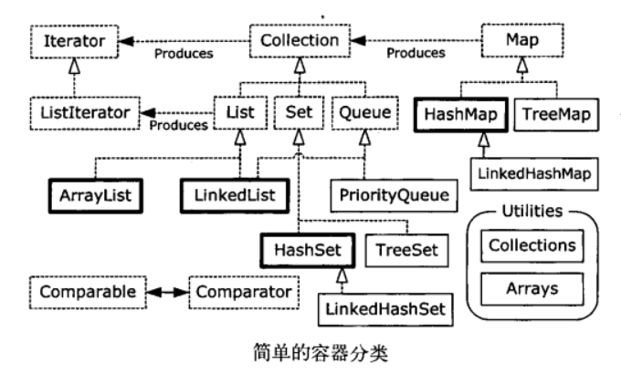

# 第11章 持有对象
在更一般的情况中，你在写程序时并不知道将需要多少个对象，或者是否需要更复杂的方式来存储对象，因此数组尺寸固定这一限制显得过于受限了。Java 实用类库还提供了一套相当完整的容器类来解决这个问题，其中**基本的类型是List.Queue和Map**。这些对象类型也称为集合类，但由于 Java 的类库中使用了Collection这个名字来指代该类库的一个特殊子集，所以我使用了范围更广的术语 **“容器”** 称呼它们。容器提供了完善的方法来保存对象，你可以使用这些工具来解决数量惊人的问题。

## 11-1 泛型与安全的容器定义
在泛型概念引入前, 容器的一个主要问题是编译器允许向一个容器中插入不同的类型。考虑一个 Apple 对象的容器, 容器类型使用 ArrayList 它继承自 List, 可以认为是长度可以扩张的数组, **有一个 `add()` 方法向序列末尾添加元素, `get()` 方法通过下标访问这些元素, `size()`方法返回 容器中的元素个数.** 正常情况下编译器会报告警告信息，因为这个示例没有使用泛型。在这里，我们使用Java SE5所特有的注解来抑制了警告信息。**注解以“@”符号开头，可以接受参数，这里的 @SuppressWarnings 注解及其参数表示只有有关“不受检查的异常”的警告信息应该被抑制**:
> // holding/ApplesAndOrangeswithoutGenerics.java
> // Simple container example (produces compiler warnings)
> 
> `@SuppressWarnings("unchecked")`
> `public static void main(Stringl] args)`
> `ArrayList apples = new ArrayList();`

这里容器内放入了 Apple 和 Orange 对象, 而他们除了都是 Object 外并无任何联系, 在访问时, 取出的都是Object索引, 之后再强制转成Apple对象并进行接下来的操作, 这里我们并不知道哪些确实是 Apple 对象, 因此程序可能出现运行时异常。

* 泛型 Generics
使用泛型, 或者说规定容器能够存放的类型, 例如:
> `ArrayList<Apple> apples = new ArrayList<Apple>();`

在第15章中，你将会了解到，使用Java泛型来创建类会非常复杂。但是，应用预定义的泛型通常会很简单。例如，要想定义用来保存Apple对象的ArrayList，你可以**声明ArrayList<Apple>而不仅仅只是ArrayList**，其中尖括号括起来的是类型参数(可以有多个).它指定了这个容器实例可以保存的类型。**通过使用泛型，就可以在编译期防止将错误类型的对象放置到容器中**.
现在，编译器可以阻止你将Orange放置到apples中，因此它变成了一个编译期错误，而不再是运行时错误。你还应该注意到，在将元素从List中取出时，**类型转换也不再是必需的了。因为List知道它保存的是什么类型，因此它会在调用get()时替你执行转型**。这样，通过使用泛型，你不仅知道编译器将会检查你放置到容器中的对象类型，而且在使用容器中的对象时，可以使用更加清晰的语法.
同时，当不需要 List 容器中对象的编号时, 可以使用 for-each 语法进行遍历。另外，假如 Apple 有着一系列的子类, 那么它们(指子类)也是一种(is-a) Apple, 可以被放入容器.
> Gala extends Apple
> Fuji extends Apple
> Braeburn extends Apple

## 11-2 Java类库的基本概念
按照存放对象的差别分为两类
(1) **Collection -- 一个独立元素的序列**
    List: 按照插入顺序保存元素
    Set: 没有重复元素
    Queue: 队列
    Stack: 栈
(2) **Map -- 一组成对的键值对对象, 允许通过键查找值**

> 修改innerclasses/Sequencejava，使你可以向其中添加任意数量的元素

### 11-2-1 添加一组元素 addAll()
* Arrays.asList()方法接受一个数组或是一个用逗号分隔的元素列表，返回一个List对象.
* Collections.addAll()方法接受一个Collection对象和一个数组或是一个用逗号分割的列表，将元素添加到Collection对象中。下面的示例展示了这两个方法，以及obj.addAll()方法
> // holding/AddingGroups.java
> // Adding groups of elements to Collection objects

* Arrays.asList() 的直接输出无法改变尺寸
你也可以直接使用 Arrays.asList() 的输出，将其当作 List ，但是在这种情况下，其底层表示的是数组，因此不能调整尺寸。如果你试图用 add() 或 delete() 方法在这种列表中添加或删除元素就有可能会引发去改变数组尺寸的尝试，因此你将在运行时获得“Unsupported Operation (不支持的作)”错误。

* Arrays.asList() 遇到间接继承时会产生问题 
```java
// holding/AsListInference.java
class Snow{}
class Powder extends Snow {}
class Light extends Powder{}
class Heavy extends Powder{}
class Crusty extends Snow {}
class Slush extends Snow {}
// won't compile:
List<Snow> snow2 = Arrays.asList(new Light(), new Heavy());
```

### 11-2-1 打印容器
**你必须使用ArraystoString0来产生数组的可打印表示，但是打印容器无需任何帮助。下面是一个例子，这个例子中也介绍了一些基本类型的容器:**

> //: holding/PrintingContainers.java
> // Containers print themselves automatically.

`ArrayList` 和 `LinkedList` 都是List类型，从输出可以看出，它们都按照被插入的顺序保存元素两者的不同之处不仅在于执行某些类型的操作时的性能，而且LinkedList 包含的操作也多于ArrayList。这些将在本章后续部分更详细地讨论。 `HashSet`, `TreeSet` 和 `LinkedHashSet` 都是Set类型，输出显示在Set中，每个相同的项只有保存一次，但是输出也显示了不同的Set实现存储元素的方式也不同。HashSet使用的是相当复杂的方式来存储元素的，这种方式将在第17章中介绍，此刻你只需要知道这种技术是最快的获取元素方式，因此，存储的顺序看起来并无实际意义 (通常你只会关心某事物是否是某个Set的成员，而不会关心它在Set出现的顺序)。如果存储顺序很重要，那么可以使用TreeSet，它按照比较结果的升序保存对象，或者使用LinkedHashSet，它按照被添加的顺序保存对象。

Map(也被称为关联数组)使得你可以用键来查找对，就像一个简单的数据库。键所关联的对象称为值。使用Map可以将美国州名与其首府联系起来，如果想知道Ohio的首府，可以将Ohio作为键进行查找，几乎就像使用数组下标一样。正由于这种行为，对于每一个键，Map只接受存储一次。Map.put(key,value)方法将增加一个值 (你想要增加的对象)并将它与某个键 (你用来查找这个值的对象)关联起来。Map·get(key)方法将产生与这个键相关联的值。

### 11-2-2 List 容器方法
1. ArrayList，它长于随机访问元素，但是在List的中间插入和移除元素时较慢。
2. LinkedList，它通过代价较低的在List中间进行的插入和删除操作，提供了优化的顺序访问, 在随机访问方面相对比较慢
>  holding/ListFeatures.java

你可以用contains()方法来确定某个对象是否在列表中。如果你想移除一个对象，则可以将这个对象的引用传递给remove()方法。同样，如果你有一个对象的引用，则可以使用idexOf()来发现该对象在List中所处位置的索引编号，就像你在输出行4中所见一样。**当确定一个元素是否属于某个List，发现某个元素的索引，以及从某个List中移除一个元素时，都会用到equals()方法 (它是根类Object的一部分)**。
**`subList()`** 方法允许你很容易地从较大的列表中创建出一个片断，而将其结果传递给这个较大的列表的 **`containsAll()`** 方法时，很自然地会得到true。还有一点也很有趣，那就是我们注意到顺序并不重要，你可以在输出行11和12中看到，在sub上调用名字很直观的 **`Collections.sort()`** **`Collection.shuffle()`** 方法，不会影响 **containsA11()** 的结果。subList() 所产生的列表的幕后就是初列表，因此，**对所返回的列表的修改都会反映到初始列表中，反之亦然**. **`retainAl1()`方法是一种有效的“交集”操作，在本例中，它保留了所有同时在copy与sub中的元素**。请再次注意，所产生的行为依赖于equals()方法。输出行14展示了用元素的索引值来移除元素的结果。与通过对象引用来移除相比，它显得更加直观，因为在使用索引值时，不必担心equals()的行为。
**`removeAll()`**方法的行为也是基于equals()方法的。就像其名称所表示的，它将从List中移除在参数List中的所有元素
**`set()`**方法的命名显得很不合时宜，因为它与Set类存在潜在的冲突。在此处，renlace可能会显得更适合，因为它的功能是在指定的索引处 (第1个参数，用第2个参数替换)


## 11-3 迭代器
**任何容器类，都必须有某种方式可以插人元素并将它们再次取回。毕竟，持有事物是容器最基本的工作**。对于List，add()是插人元素的方法之一，而get()是取出元素的方法之一如果从更高层的角度思考，会发现这里有个缺点:要使用容器，必须对容器的确切类型编程。初看起来这没什么不好，但是考虑下面的情况:如果原本是对着List编码的，但是后来发现如果能够把相同的代码应用于Set，将会显得非常方便，此时应该怎么做?或者打算从头开始编写通用的代码，它们只是使用容器，不知道或者说不关心容器的类型，那么如何才能不重写代码就可以应用于不同类型的容器?

**送代器(也是一种设计模式)的概念可以用于达成此目的。迭代器是一个对象，它的工作是遍历并选择序列中的对象，而客户端程序员不必知道或关心该序列底层的结构**。此外，迭代器通常被称为轻量级对象:创建它的代价小。因此，经常可以见到对迭代器有些奇怪的限制例如，Java的Iterator只能单向移动，这个Iterator只能用来:
**1)使用方法iterator()要求容器返回一个Iterator。Iterator将准备好返回序列的第一个元素
2)使用next()获得序列中的下一个元素
3)使用hasNext()检查序列中是否还有元素。
4)使用remove()将迭代器新近返回的元素删除**

有了Iterator就不必为容器中元素的数量操心了，那是由hasNext()和next()关心的事情。如果你只是向前遍历List，并不打算修改List对象本身，那么你可以看到for-each语法会显得更加简洁。Iterator还可以移除由next()产生的最后一个元素，这意味着在调用remove()之前必须先调用next()接受对象容器并传递它，从而在每个对象上都执行操作，这种思想十分强大，并且贯穿于本书
> // holding/SimpleIteration.java
> 演示 iterator 的工作方式
> 修改innerclasses/Sequence.java，使得在Sequence中，用Iterator取代Selector

ListIterator是一个更加强大的Iterator的子类型，它只能用于各种List类的访问。尽管Iterator只能向前移动，但是ListIterator可以双向移动. 你可以通过调用`listIterator()`方法产生一个指向List开始处的ListIterator，并且还可以通过调用`listIterator(n)`方法创建一个一开始就指向列表索引为的元素处的ListIterator

### 11-3-1. Collection or Iterator ?
Collection是描述所有序列容器的共性的根接口，它可能会被认为是一个 "附属接口"，即因为要表示其他若千个接口的共性而出现的接口。另外，java.util.AbstractCollection 类提供了Collection的默认实现，使得你可以创建AbstractCollection的子类型，而其中没有不必要的代码重复。
使用接口描述的一个理由是它可以使我们能够创建更通用的代码。通过针对接口而非具体实现来编写代码，我们的代码可以应用于更多的对象类型。因此，如果我编写的方法将接受个Collection，那么该方法就可以应用于任何实现了Collection的类一这也就使得一个新类可以选择去实现Collection接口，以便我的方法可以使用它。但是，有一点很有趣，就是我们注意到标准C++类库中并没有其容器的任何公共基类一-容器之间的所有共性都是通过选代器大成的。在Java中，遵循C++的方式看起来似乎很明智，即用迭代器而不是Collection来表示容器之间的共性。但是，这两种方法绑定到了一起，因为实现Collection就意味着需要提供iterator()方法

> holding/InterfaceVsiterator.java

两个版本的display()方法都可以使用Map或Collection的子类型来工作，而且**Collection接口和Iterator都可以将display()方法与底层容器的特定实现解耦**。在本例中，这两种方式都可以凑效。事实上，Collection要更方便一点，因为它是Iterable类型，因此，在display(Collection)实现中，可以使用**for-each**结构，从而使代码更加清晰。**当你要实现一个不是Collection的外部类时，由于让它去实现Collection接口可能非常困难或麻烦，因此使用Iterator就会变得非常吸引人**。例如，如果我们通过继承一个持有Pet对象的类来创建一个Collection的实现，那么我们必须实现所有的Collection方法，即使我们在display()方法中不必使用它们，也必须如此。尽管这可以通过继承AbstractCollection而很容易地实现，但是你无论如何还是要被强制去实现iterator()和size()，以便提供AbstractCollection没有实现，但是AbstractCollection中的其他方法会使用到的方法;

从本例中，你可以看到，如果你实现Collection，就必须实现iterator()，并且只拿实现iterator()与继承AbstractCollection相比，花费的代价只有略微减少。但是，如果你的类已经继承了其他的类，那么你就不能再继承AbstractCollection了。在这种情况下，要实现Collection.就必须实现该接口中的所有方法。此时，继承并提供创建迭代器的能力就会显得容易得多了
> holding/NonCollectionSequence.java
生成Iterator是将队列与消费队列的方法连接在一起耦合度最小的方式，并且与实现Collection相比，它在序列类上所施加的约束也少得多。


### 11-3-2. for-each and iterator
**Java SE5引入了新的被称为`Iterable`的接口，该接口包含一个能够产生`Iterator`的`iterator()`方法，并且`Iterable接口`被`foreach`用来在序列中移动。因此如果你创建了任何实现Iterable的类，都可以将它用于foreach语句中**:
> //: holding/IterableClass.java
> // Anything Iterable works with foreach

在Java SE5中，大量的类都是Iterable类型，主要包括所有的Collection类 (但是不包括各种Map)。例如，下面的代码可以显示所有的操作系统环境变量
> //: holding/EnvironmentVariables.java

`System.getenv()`返回一个Map, `entrySet()`产生一个由`Map.Entry`的元素构成的Set，并这个Set是一个Iterable，因此它可以用于foreach循环。

> 修改polymorphism/shape/RandomShapeGenerator;java，使其成为一个Iterable你需要添加一个接收元素数量为参数的构造器，这个数量是指在停止之前，你想用迭代器生成的元素的数量。验证这个程序可以工作。

这里，我希望在默认的前向迭代器的基础上，添加产生反向迭代器的能力，因此我不能使用覆盖，而是添加了一个能够产生Iterable对象的方法，该对象可以用于foreach语句。正如你所见，这使得我们可以提供多种使用foreach的方式:
> //: holding/AdapterMethodIdiom.java
> 再添加一个随机访问的 for-each 方法

* **`Arrays.asList()`直接使用数组作为底层物理实现**
>  holding/ModifyingArraysAsList.java

在第一种情况中，Arrays.asList() 的输出被传递给了 ArrayList() 的构造器，这将创建一个引用ia的元素的ArrayList，因此打乱这些引用不会修改该数组。但是，如果直接使用Arrays.asList(ia)的结果，这种打乱就会修改ia的顺序。**意识到Arrays.asList()产生的List对象会使用底层数组作为其物理实现是很重要的。只要你执行的操作会修改这个List，并且你不想原来的数组被修改，那么你就应该在另一个容器中创建一个副本**。

## 11-4. LinkedList
`LinkedList` 完全包含了 队列、栈、双端队列 等的方法(这些数据结构往往只在两端操作而不需要随机访问)
### 1. Stack
> LIFO容器
```java
// Making a stack from a LinkedList
package net.mindview.util;
import java.util.LinkedList:
public class Stack<T> {
    private LinkedList<T> storage = new LinkedList<T>();
    public void push(T v){ storage.addFirst(v); }
    public T peek() { return storage.getFirst(); }
    public T pop(){ return storage.removeFirst(); }
    public boolean empty() { return storage.isEmpty(); }
    public String toString() { return storage.toString(); }
}///:-
```
这里通过使用**范型**，引人了在栈的类定义中最简单的可行示例。类名之后的 **<T>告诉编译器这将是一个参数化类型** ，而其中的类型参数，即在类被使用时将会被实际类型替换的参数，就是T。大体上，这个类是在声明 **"我们在定义一个可以持有T类型对象的Stack"**. Stack是用LinkedList实现的，而LinkedList也被告知它将持有T类型对象。注意，push()接受的是T类型的对象，而 peek() 和 pop() 将返回T类型的对象。peek() 方法将提供栈顶元素，但是并不将其从栈顶移除，而pop()将移除并返回栈顶元素。

### 2. Set
**Set不保存重复的元素** (至于如何判断元素相同则较为复杂，稍后便会看到)。如果你试图将相同对象的多个实例添加到Set中，那么它就会阻止这种重复现象。Set中最常被使用的是测试归属性，你可以很容易地询问某个对象是否在某个Set中。正因如此，查找就成为了Set中最重要的操作，因此你通常都会选择一个HashSet的实现，它专门对快速查找进行了优化。
> holding/SetOfInteger .java

输出的顺序没有任何规律可循, 这是因为出于速度原因的考虑, `HashSet` 使用了散列一散列将在第17章中介绍。HashSet所维护的顺序与 `TreeSet` 或 `LinkedHashSet` 都不同，因为它们的实现具有不同的元素存储方式。**TreeSet将元素存储在红-黑树数据结构中，而HashSet使用的是散列函数。LikedHashList因为查询速度的原因也使用了散列，但是看起来它使用了链表来维护元素的插入顺序**。

你将会执行的最常见的操作之一，就是使用contains()测试Set的归属性，但是还有很多操作会让你想起在上小学时所教授的文氏图(译者注，用圆表示集与集之间关系的图)
> holding/SetOperations.java

### 3. Map
将对象映射到其他对象的能力是一种解决编程问题的杀手。例如，考虑一个程序，它将用来检查Java的Random类的随机性。理想状态下，Random可以将产生理想的数字分布，但要想测试它，则需要生成大量的随机数，并对落入各种不同范围的数字进行计数。Map可以很容易地解决该问题。在本例中，键是由Random产生的数字，而值是该数字出现的次数
> holding/Statistics.java

Map与数组和其他的Collection一样，可以很容易地扩展到多维，而我们只需将其值设置为Map (这些Map的值可以是其他容器，甚至是其他Map)。因此，我们能够很容易地将容器组合起来从而快速地生成强大的数据结构。例如，假设你正在跟踪拥有多个宠物的人，你所需只是一个 `Map<Person,List<Pet>>`

### 4. Queue

队列是一个典型的先进先出 (FIFO) 的容器。即从容器的一端放入事物，从另一端取出并且事物放入容器的顺序与取出的顺序是相同的。队列常被当作一种可靠的将对象从程序的某个区域传输到另一个区域的途径。队列在并发编程中特别重要，就像你将在第21章中所看到的因为它们可以安全地将对象从一个任务传输给另一个任务。LinkedList提供了方法以支持队列的行为，并且它实现了Queue接口，因此LinkedList可以用作Queue的一种实现。通过将LinkedList向上转型为Queue，下面的示例使用了在Queue接口中与Quene相关的方法
>  holding/QueueDemo.java

`offer()`方法是与Queue相关的方法之一，它在允许的情况下，将一个元素插人到队尾，或者返回false。peek()和element()都将在不移除的情况下返回队头，但是`peek()`方法在队列为空时返回null，而element()会抛出NoSuchElementException异常。`poll()`和remove()方法将移除并返回队头，但是poll()在队列为空时返回null，而remove()会抛出NoSuchElementException异常。
> 写一个称为Command的类，它包含一个String城和一个显示该String的operation0方法。写第二个类，它具有一个使用Command对象来填充一个Queue并返回这个对象的方法。将填充后的Queue传递给第三个类的一个方法，该方法消耗掉Queue中的对象，并调用它们的operation0方法。
>
#### 4-1. Priority Queue
**优先级队列声明下一个弹出元素是最需要的元素(具有最高的优先级)**。例如，在飞机场当飞机临近起飞时，这架飞机的乘客可以在办理登机手续时排到队头。如果构建了一个消息系统，某些消息比其他消息更重要，因而应该更快地得到处理，那么它们何时得到处理就与它们何时到达无关。PriorityQueue添加到Java SE5中，是为了提供这种行为的一种自动实现。**当你在PriorityQueue上调用offer()方法来插入一个对象时，这个对象会在队列中被排序默认的排序将使用对象在队列中的自然顺序，但是你可以通过提供自己的Comparator来修改这个顺序**。PriorityQueue可以确保当你调用 `peek()` `poll()` 和 `remove()`方法时，获取的元素将是队列中优先级最高的元素。

> //: holding/PriorityQueueDemo.java

示例展现了 PriorityQueue 在 String 和 Double 等内置类型上的操作

## 11-5 总结


可以看到，除了 `TreeSet` 之外的所有 `Set` 都拥有与 `Collection` 完全一样的接口。`List` 和 `Collection` 存在着明显的不同，尽管 `List` 所要求的方法都在`Collection` 中。另一方面，在 `Queue` 接口中的方法都是独立的，在创建具有 `Queue` 功能的实现时，不需要使用 `Collection` 方法。最后 `Map` 和 `Collection` 之间的唯一重叠就是Map可以使用`entrySet()`和 `values()` 方法来产生Collection。注意，标记接口java.util.RandomAccess附着到了ArrayList上，而没有附着到LinkedList上这为想要根据所使用的特定的List而动态修改其行为的算法提供了信息。

