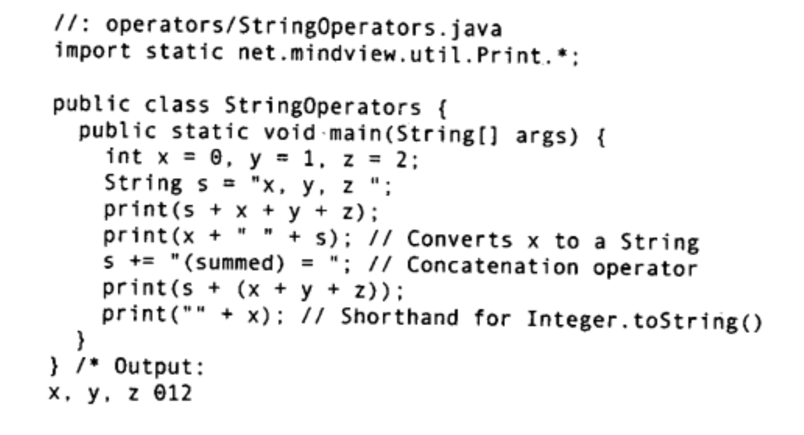
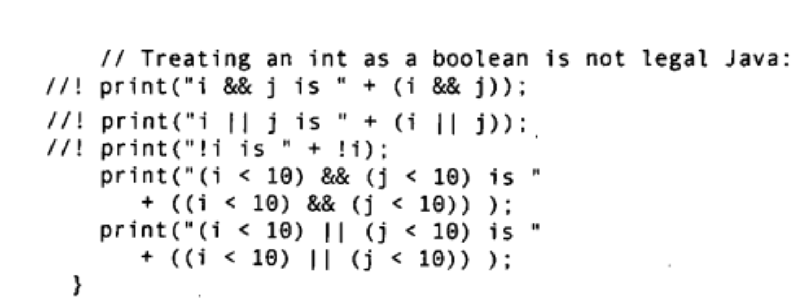
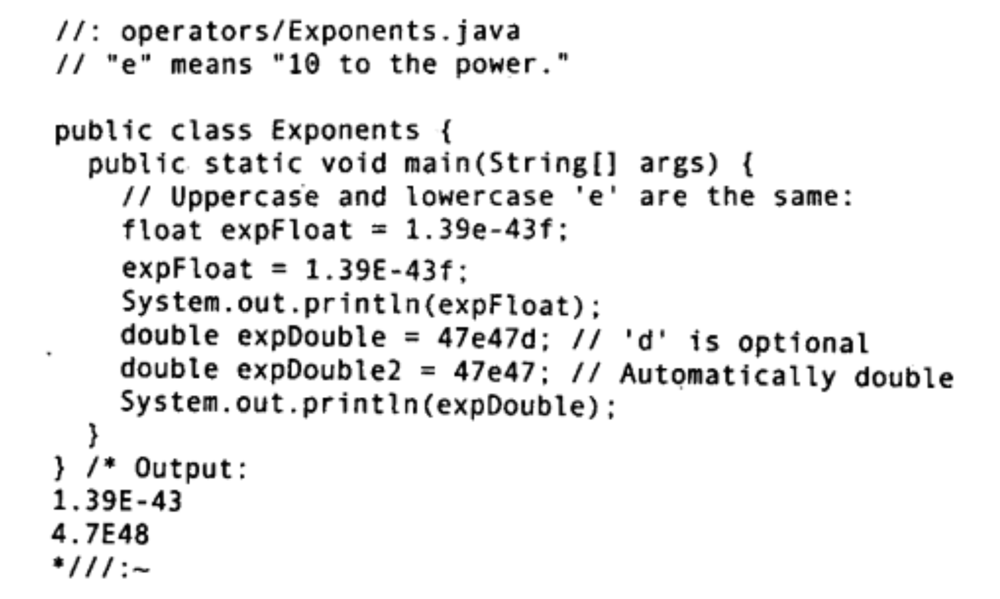

# 第03章 操作符
赋值(=), 算术运算符(+-*/%), 自动递增和递减(++/--op, op++/--), 关系运算符(==, !=, >, >=, <, <=), 逻辑操作符(&& || !), 位运算符(&|~^)
## 3-1. 赋值
我们使用引用来操作对象，因此引用之间的赋值类比为【别名】
```java
String s1 = "Hello";
String s2 = new String("Java");
s1 = s2;    // 将s2赋值给s1, 此时s1这一引用指向了 new String("Java") 这一对象, "Hello"这一对象就没有引用指向它了
```
所有的基本类型都可以进行赋值操作，
## 3-2. 算术运算符
+-*/%, 可以和=搭配更简洁高效
a += b // a <- a+b
注意boolean类型不可以进行算术操作，且整数不可以隐式或显式的转为boolean类型. 另外String类型的对象可以直接使用+, +=, 操作对象还可以是整数

```java
/*TODO: 演示字符串拼接*/
```
## 3-3. 自动递增递减操作符
++a;	// 先对对象本身进行自增再进行其他操作
a++;	// 先使用对象做其他操作在对对象自增
j = ++i;	// i <- j; i <- i+1
## 3-4. 关系运算符
关系运算符得到的结果为布尔值，操作对象是两个整数、浮点数等等，不可以是布尔值，也即布尔值不能比较大小（但可以判断是否相等）。这里再次提到对象都是通过指向它的引用来进行操作的，因此指向对象不同，两个引用就不等——即便两个对象的内容或含义相同，此时应该利用**equals()**方法判断是否相等。
## 3-5 逻辑操作符
逻辑操作符仅用于布尔值之间，包括与(&&), 或(||), 非(!)

## 3.7 常量
使用L, F, D等后缀指明常量的基本类型(long, float, double), 另外, Java采用aEb的方式表示指数计数

```java
/*TODO*/
float a = 1.39E-43f;	// 展示flaot和double所能表示的最大/最小正数
```
## 3.8 按位操作与移位运算
按位操作包括与(&)或(|)非(~), 他们都可以与=连用, 移位操作包括左移 << , 低位补0; 右移 >> , 负数高位补1正数补0; 逻辑右移 >>>, 高位补 0

其他的还包括三元操作符 c <- condition ? A: B

