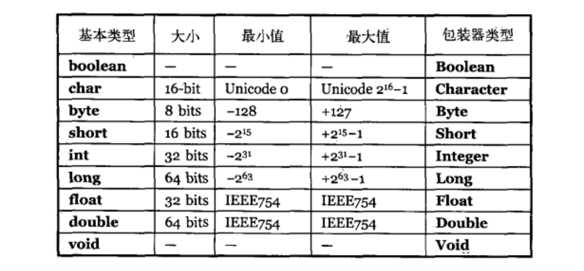
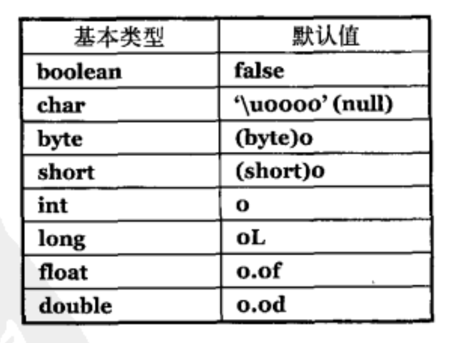

# 第02章 一切都是对象
除基本类型外，一切对象都由自己创建，这通过new关键字实现，必须通过引用来操作对象，这些对象存放在堆中，堆是一种通用的由RAM构成的内存池。值得注意的是，其他还有四种存储方式包括：寄存器存储、堆栈存储、（堆内存分配）、常量存储、外部存储（流对象、持久化对象）。由于垃圾回收器的存在，你永远不要试图自己手动清理一个对象。

表2-1. Java基本类型的大小、值域、包装类等信息一览

注意Java还提供了两个用于高精度计算的类: **BigInteger**(int)和**BigDecimal**
**问题2-1. Java中float和double的表示范围是多少？**
```java
/*TODO*/
```
## 2-1. 类：对象的类型
类确定了对象的类型，它是对象的模板，规定者对象的外观和行为，具有字段和方法，其中的基本成员会被赋予默认值

表2-2. 类内部定义的基本类型字段默认值



