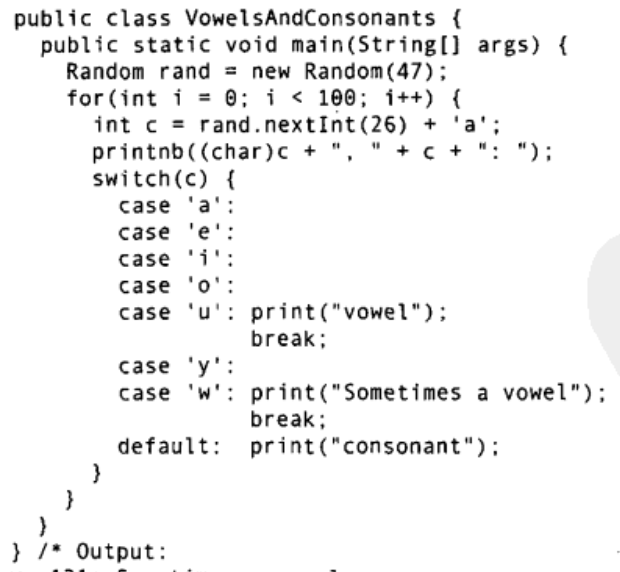
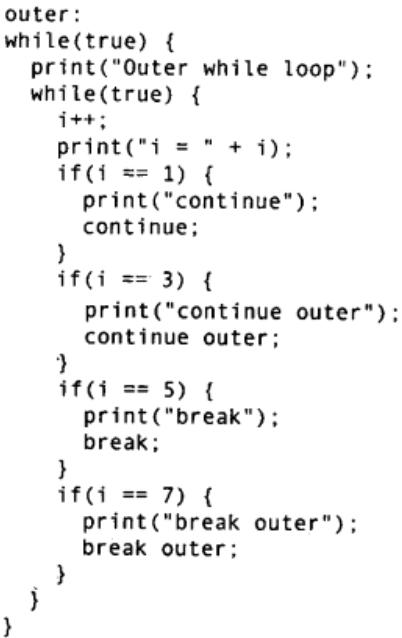
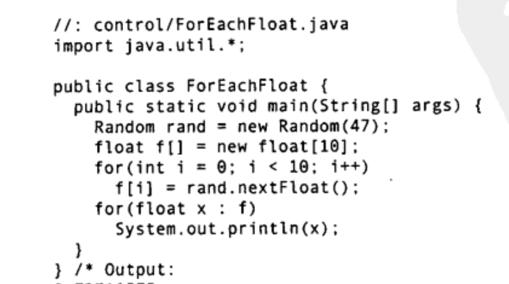
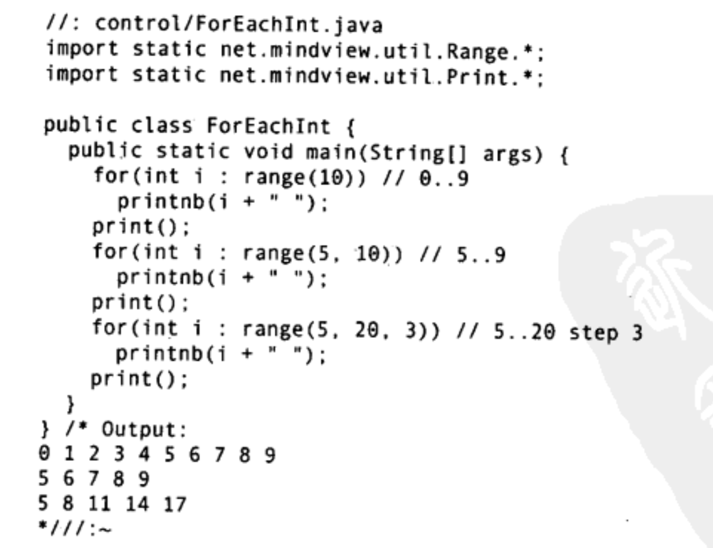

分支、循环、开关语句等等
## 分支if-else
如果条件成立执行该部分代码否则执行另一部分代码
```java
if(condition){
    // do something
}else if{
    // do other thing
}else{
    // do other thing
}
```
开关语句 switch-case 可被认为是分支表达式 或者 选择语句, 依据整数值选择某一情况执行
```java
switch(num){
    case n1: // do something
    case n2: break;// do something
    ...
    case nm: // do something
    default: // do something
}
```
执行过程是将num与case后的数字一一比较，选择相等一个，从冒号后继续执行, 直到遇到break跳出switch代码块, 否则
一直向下执行到default, 而若没有找到这样的匹配, 就执行default语句

```java
// TODO
// 如上图, 实现随机生成字母并判断字母是否为元音的程序
```
## 循环
1. while
   while(cond){ do something; }

2. do-while
   do{
    something;
   }while(cond)

3. for
   for( a; b; c){
    do something;
   }
   a是初始化语句, 例如 int i=0;
   b是循环结束判断, 例如 i<10, 在 do something前执行;
   c是迭代语句, 例如 i++, 在do something后执行;
另外, break和continue与for也可搭配使用, 例如do something中有一个判断语句, 成立则立即终止循环跳出for循环代码块
而continue则是执行该语句后立即跳转到c迭代语句开始下一次循环

**在Java中, 允许有限制的使用标签(label)达到类似于"goto"的效果, 它仅仅出现在需要跳出多重循环的场合**
同样的规则亦适用于while:
1)一般的continue会退回最内层循环的开头(顶部)，并继续执行
2)带标签的continue会到达标签的位置，并重新进入紧接在那个标签后面的循环
3)一般的break会中断并跳出当前循环
4)带标签的break会中断并跳出标签所指的循环
要记住的重点是:在Java里需要使用标签的唯一理由就是因为有循环套存在，而且想从多层嵌套中break或continue。
在Diikstra的《Goto有害》的论文中，他最反对的就是标签，而非goto。他发现在一个程序里随着标签的增多，产生的错误也会越来越多，并且标签和goto使得程序难以分析。但是，Java的标签不会造成这种问题，因为它们的应用场合已经受到了限制，没有特别的方式用于改变程序的控制。由此也引出了一个有趣的现象:通过限制语句的能力，反而能使一项语言特性更加有用。

```java
// TODO
// 实现验证上述的标签语法
```


**for循环常常用于遍历, 例如遍历容器中的元素, 为了使遍历语法更符合OOP思想, 出现了for each语法, 隐藏了下标细节**



```java
// TODO
// 1. 重复第3章中的练习10，不要用Integer.toBinaryString方法，而是用三元操作符和按位操作符来显示二进制的1和0
// 2. 对range()函数进行实现
/* 3. 练习10:(5)吸血鬼数字是指位数为偶数的数字，可以由一对数字相乘而得到，而这对数字各包含乘积的一半位数的数字，其中从最初的数字中选取的数字可以任意排序。以两个0结尾的数字是不允许的，例如，下列数字都是“吸血鬼”数字:
1260 = 21 * 60
1827 =21 *87
2187 =27*81
写一个程序，找出4位数的所有吸血鬼数字 (Dan Forhan推荐)
*/
```
