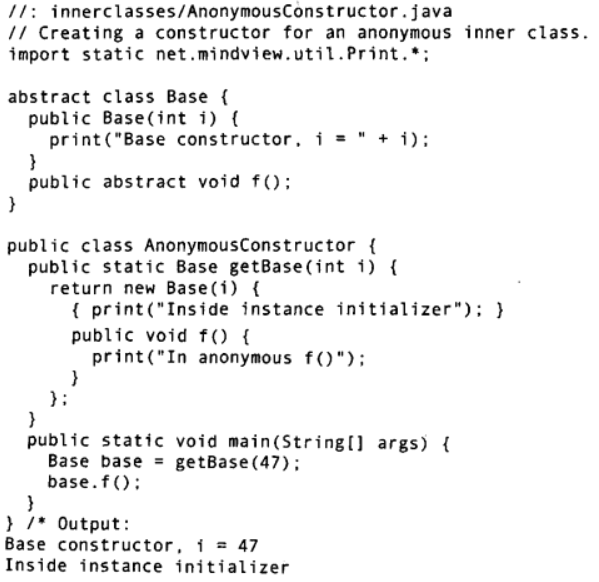

# 第10章 内部类
可以**将一个类的定义放在另一个类的定义内部，这就是内部类**。内部类是一种非常有用的特性，因为它允许你把一些逻辑相关的类组织在一起，并控制位于内部的类的可视性。然而**必须要了解，内部类与组合是完全不同的概念，这一点很重要**。在**最初，内部类看起来就像是一种代码隐藏机制:将类置于其他类的内部**。但是，你将会了解到，**内部类远不止如此，它了解外围类，并能与之通信，而且你用内部类写出的代码更加优雅而清晰**，尽管并不总是这样。
最初，内部类可能看起来有些奇怪，而且要花些时间才能在设计中轻松地使用它们。对内部类的需求并非总是很明显的，但是在描述完内部类的基本语法与语义之后，10.8节就应该使得内部类的益处明确显现了

## 10.2 内部类的创建与使用
内部类是一种名字隐藏和组织代码的方式。另一方面，**一个内部类的对象与外围对象(enclosing object)之间有这样的联系：内部类对象能访问其外围对象的所有成员，而需要任何特殊条件**(这与C++嵌套类的设计非常不同，在C++中只是单纯的名字隐藏机制，与外围对象没有联系，也没有隐含的访问权)
> 例一、Sequnce.java
> 关键词：**内部类**、**迭代器设计模式**
> Selector 是一个接口, 包含 end()/ current()/ next() 方法
> Suquence 类包含一个private的序列, 包含一个 add() 方法, 一个实现了
> Selector 的私有内部类 SequenceSelector

Sequence类只是一个固定大小的Object的数组，以类的形式包装了起来。可以调用 add()在序列末增加新的Object (只要还有空间)。要获取Sequence中的每一个对象，可以使用Selector接口。**这是“迭代器”设计模式的一个例子**，在本书稍后的部分将更多地学习它。Selector允许你检查序列是否到末尾了 (end())，访向当前对象 (current())，以及移到序列中的下一个对象(next())。

所以内部类自动拥有对其外围类所有成员的访问权。这是如何做到的呢?**当某个外围类的对象创建了一个内部类对象时，此内部类对象必定会秘密地捕获一个指向那个外围类对象的引用**。然后，在你访问此外围类的成员时，就是用那个引用来选择外围类的成员。幸运的是，编译器会帮你处理所有的细节，但你现在可以看到: 内部类的对象只能在与其外围类的对象相关联的情况下才能被创建(就像你应该看到的，在内部类是非static类时)。构建内部类对象时需要一个指向其外围类对象的引用，如果编译器访问不到这个引用就会报错。


## 10.3 .this与.new
如果你需要**生成对外部类对象的引用。可以使用外部类的名字后面紧跟点和this**。这样产生的引用自动地具有正确的类型，这一点在编译期就被知晓并受到检查，因此没有任何运行时开销。
> DotThis.java
> 外部类有一个方法f() 和 一个内部类, 内部类有一个方法返回外部类的引用,
> 测试获取这一引用并调用f()

有时你可能想要**告知某些其他对象，去创建其某个内部类的对象**。要实现此目的，你必须在new表达式中提供对其他外部类对象的引用，这是需要使用.new语法

> DotNew.java
> 演示上述语法
练习
> 在Sequence.SequenceSelector类中增加一个方法，它可以生成对外部类Sequence的引用
> 实现 Parcel3 类, 该类分别包含包装了一个整数和一个字符串的包装类，创建他们的

当将内部类向上转型为其基类，尤其是转型为一个接口的时候，内部类就有了用武之地。(从实现了某个接口的对象，得到对此接口的引用，与向上转型为这个对象的基类，实质上效果是一样的。) 这是因为此内部类一-某个接口的实现一一能够完全不可见，并且不可用。所得到的只是指向基类或接口的引用，所以能够很方便地隐藏实现细节。

> 实现 Parcel4 类, 主要是 移出整数和字符串包装类使之成为接口，在其内部定义私有内部类实现接口

> 创建一个含有private域和private方法的类。创建一个内部类，它有一个方法可用来修改外围类的域，并调用外围类的方法。在外围类的另一方法中，创建此内部类的对象，并且调用它的方法，然后说明对外围类对象的影响。

Parcel4中增加了一些新东西:内部类PContents是private，所以除了Parcel4，没有人能访问它。PDestination是protected，所以只有Parcel4及其子类、还有与Parcel4同一个包中的类(因为protected也给予了包访问权)能访问PDestination，其他类都不能访问PDestination。这意味着，如果客户端程序员想了解或访问这些成员，那是要受到限制的。实际上，甚至不能向下转型成private内部类(或protected内部类，除非是继承自它的子类)，因为不能访问其名字，就像在TestParcel类中看到的那样。于是，**private内部类给类的设计者提供了一种途径，通过这种方式可以完全阻止任何依赖于类型的编码，并且完全隐藏了实现的细节**。此外，从客户端程序员的角度来看，由于不能访问任何新增加的、原本不属于公共接口的方法，所以扩展接口是没有价值的。这也给Java编译器提供了生成更高效代码的机会

## 10.4 局部内部类
局部内部类是指定义在方法和作用域内部的类，例如可以在一个if语句块内定义一个类，这并不是说这个局部内部类是条件创建的，这个类与其他类一起的编译，但仅在if语句块内可见。
> 实现 Parcel5.java 它演示了在 destination 方法内定义PDestination类并返回它一个对象的引用

## 10.5 匿名内部类

> 实现 Parcel6.java 它演示了在 contents 方法体内创建一个匿名内部类PContents的对象并返回引用

contents()方法将返回值的生成与表示这个返回值的类的定义结合在一起!另外，这个类是匿名的，它没有名字。这种奇怪的语法指的是 "创建一个继承自Contents的匿名类的对象"通过new表达式返回的引用被**自动向上转型为对Contents的引用**。以下介绍了更多可能的用法示例

> 1). 一个匿名类，它扩展了有非默认构造器的类.
> Warpping类包含一个接受一个整型值参数的构造器, 用于初始化一个整数域, 另外有一个方法返回该整数。实现 Parcel7.java 它包含一个创建 Warpping 匿名内部类的方法。

如果你的基类需要一个有参数的构造器，只需简单地传递合适的参数给基类的构造器即可，这里是将x传进new Wrapping(x)。

> 2). 一个匿名类，它执行字段初始化
> 也即，你可以在匿名类内部定义字段, 并借助传入的参数对字段进行初始化。实现这一示例 Parcel8.java
如果定义一个匿名内部类，并且希望它使用一个在其外部定义的对象，那么编译器会要求其参数引用是final的，就像你在destination()的参数中看到的那样。

3). 一个匿名类，它通过实例初始化实现构造 (匿名类不可能有构造器)

在此例中，不要求变量i一定是final的。因为i被传递给匿名类的基类的构造器，它并不会在匿名类内部被直接使用。

## 10.6 工厂模式与匿名内部类
匿名内部类将代码变得整洁、漂亮、优雅

> 1. 重新实现 `Interfaces/Factories.java`
> 2. 重新实现 `Interfaces/Games.java`

### 10.7 内部类的其他细节
#### 10.7.1 嵌套类: static
**如果不需要内部类对象与其外围类对象之间有联系, 那么可以将内部类声明为static, 这通常称为嵌套类**。想要理解static应用于内部类时的含义，就必须记住，普通的内部类对象隐式地保存了一个引用，指向创建它的外围类对象。然而，当内部类是static的时，就不是这样了**嵌套类意味着:
1)要创建类的对象，并不需要其外围类的对象
2)不能从嵌套类的对象中访问非静态的外对象**
嵌套类与普通的内部类还有一个区别。普通内部类的字段与方法，只能放在类的外部层次上，所以普通的内部类不能有static数据和static字段，也不能包含嵌套类。但是嵌套类可以包含所有这些东西.
#### 10.7.2 接口内部的类
正常情况下，不能在接口内部放置任何代码，但嵌套类可以作为接口的一部分。你**放到接口中的任何类都自动地是public和static的。因为类是static的，只是将嵌套类置于接口的命名空间内，这并不违反接口的规则** 你其至可以在内部类中实现其外围接口。
#### 10.7.3 内部类可以被继承吗
因为内部类的构造器必须连接到指向其外围类对象的引用，所以在继承内部类的时候，事情会变得有点复杂。问题在于，那个指向外围类对象的“秘密的”引用必须被初始化，而在导出类中不再存在可连接的默认对象。要解决这个问题，必须使用特殊的语法来明确说清它们之间的关联:
```java
public class InheritInner extends WithInner.Inner {
    //! InheritInner() {} // Won't compile
    InheritInner(withInner wi) {
        wi.super();
        // something else
    }
}
```

## 10.8 为什么需要内部类
一般说来，内部类继承自某个类或实现某个接口，内部类的代码操作创建它的外围类的对象。所以可以认为内部类提供了某种进入其外围类的窗口。**内部类必须要回答的一个问题是:如果只是需要一个对接口的引用，为什么不通过外围类实现那个接口呢?答案是“如果这能满足需求，那么就应该这样做.** 那么内部类实现一个接口与外围类实现这个接口有什么区别呢?答案是:后者不是总能享用到接口带来的方便，有时需要用到接口的实现。所以，**使用内部类最吸人的原因是:每个内部类都能独立地继承自一个 (接口的) 实现，所以无论外围类是否已经继承了某个(接口的)实现，对于内部类都没有影响。** 如果没有内部类提供的、可以继承多个具体的或抽象的类的能力，一些设计与编程问题就很难解决。从这个角度看，**内部类使得多重继承的解决方案变得完整。接口解决了部分问题，而内部类有效地实现了"多重继承"** 也就是说，内部类允许承多个非接口类型 (译注:类或抽象类)。

为了看到更多的细节，让我们考这样一种情形，即必须在一个类中以某种方式实现两个接口。由于接口的灵活性，你有两种选择:使用单一类，或者使用内部类. 如果不需要解决“多重继承”的问题，那么自然可以用别的方式编码，而不需要使用内部类。但如果使用内部类，还可以获得其他一些特性:
1)内部类可以有多个实例，每个实都有自己的状态信息，并且与其外围类对象的信息相互独立。
2)在单个外围类中，可以让多个内部类以不同的方式实现同一个接口，或继承同一个类后就会展示一个这样的例子。
3)创建内部类对象的时刻并不依赖于外围类对象的创建。
4)内部类并没有令人迷惑的“is-a”关系，它就是一个独立的实体. **举个例子，如果 Sequence.java不使用内部类，就必须声明 `Sequence是一个Selector`，对于某个特定的Sequence只能有一个Selector。然而使用内部类很容易就能拥有另一个方法reverseSelector()，用它来生成一个反方向遍历序列的Selector。只有内部类才有这种灵活性。**

> 为 Sequence 设计多个 selector

### 10.8.2 闭包与回调
**闭包(closure) 是一个可调用的对象，它记录了一些信息，这些信息来自于创建它的作用域。通过这个定义，可以看出`内部类是面向对象的闭包`，因为它不仅包含外围类对象 (创建内部类的作用域)的信息，还`自动拥有一个指向此外围类对象的引用`，在此作用域内，内部类有权操作所有的成员，包括private成员。** 在JAVA中，内部类可以访问到外围类的变量、方法或者其它内部类等所有成员（即使它被定义成private了）但是外部类不能访问内部类中的变量。这样通过内部类就可以提供一种代码隐藏和代码组织的机制，并且这些被组织的代码段还可以自由地访 问到包含该内部类的外围上下文环境。

为什么需要 final 来修饰被闭包调用的变量？
在Java中，我们都知道方法参数传递是引用传递而非值传递，用一个简单的例子来说明：我们将方法 People.get("老王") 得到的 People 对象传递给方法 managePeople(People p)，managePeople 方法得到的是这个 老王 People 对象的一个地址值。如果我们在闭包内修改了这个对象的某个属性的值，那么就会造成这个对象的值被全局污染使得其他方法在调用该 王五 对象时发现参数被修改了，同样的如果在多线程中，不论是外部方法还是闭包本身造成数据污染都会导致数据的不一致性，这就违背了缓存一致性协议。
 通过 final 来修饰变量就使得闭包内部调用时不受外部影响也防止了闭包内部修改导致外部不一致，但值得注意的是在多线程下如果外部进行了值修改则仍然会导致与闭包内的对象数据不一致，这就需要对对象的修改进行适当的控制（可参考Vue3的变量监听与多级缓存来设计一类注解防止并行过程中修改导致的数据不一致）。

Java最引人争议的问题之一就是，人们认为Java应该包含某种类似指针的机制，以允许回调callback)。**通过回调，对象能够携带一些信息，这些信息允许它在稍后的某个时刻调用初始的对象**。稍后将会看到这是一个非常有用的概念。如果回调是通过指针实现的，那么就只能寄希望于程序员不会误用该指针。然而，读者应该已经了解到，Java更小心仔细，所以没有在语言中包括指针。
通过内部类提供闭包的功能是优良的解决方案，它比指针更灵活、更安全。见下例
> //: whyInner/Callbacks.iava
```java
class Callee2 extends MyIncrement{
    private int i = 0;
    public void increment() {
        super.increment();
        ++i;
        System.out.println("i = "+i);
    }
    private class Closure implements Incrementable{
        @Override
        public void increment() {
            Callee2.this.increment();
        }
    }
    public Incrementable getCallbackReference(){
        return new Closure();
    }
}
```
这个例子进一步展示了外围类实现一个接口与内部类实现此接口之间的区别。就代码而言Callee1是简单的解决方式。Callee2继承自MyIncrement，后者已经有了一个不同的increment()方法，并且与Incrementable接口期望的increment()方法完全不相关。在这里可以看到，interface是如何允许接口与接口的实现完全独立的。内部类Closure实现了Incrementable，以提供一个返回Callee2的“钩子”(hook)一一而且是一个安全的钩子。**无论谁获得此Incrementable的引用，都只能调用increment0，除此之外没有其他功能 (不像指针那样，允许你做很多事情)。** Caller的构造器需要一个Incrementable的引用作为参数 (虽然可以在任意时刻捕获回调引用)，然后在以后的某个时刻，Caller对象可以使用此引用回调Callee类。回调的价值在于它的灵活性一一可以在运行时动态地决定需要调用什么方法。这样做的好处在第22章可以看得更明显，在那里实现GUI功能的时候，到处都用到了回调

### 10.8.3 回调
**回调是一种双向的调用模式，程序模块之间通过这样的接口调用完成`通信`联系**，回调的核心就是回调方将本身即this传递给调用方，这样调用方就可以在调用完毕之后再告诉回调方它想要知道的信息。

回调函数用于层间协作，**上层将本层函数安装在下层，这个函数就是回调**，而下层在一定条件下触发回调，例如作为一个驱动，是一个底层，他**在收到一个数据时，除了完成本层的处理工作外，还将进行回调，它将这个数据交给上层应用层来做进一步处理，这在分层的数据通信中很普遍**。其实回调和API非常接近，他们的共性都是跨层调用的函数。但区别是API是低层提供给高层的调用，一般这个函数对高层都是已知的；而回调正好相反，他是高层提供给底层的调用，对于低层他是未知的，必须由高层进行安装。这个安装函数其实就是一个低层提供的API，安装后低层不知道这个回调的名字，但它通过一个函数指针来保存这个回调，在需要调用时，只需引用这个函数指针和相关的参数指针。

其实：回调就是该函数写在高层，低层通过一个函数指针保存这个函数，在某个事件的触发下，低层通过该函数指针调用高层那个函数。从调用方式上看，可以分为两类：同步回调、异步回调。

> 比较经典的回调方式：
> Class A实现接口CallBack callback——背景1
> class A中包含一个class B的引用b ——背景2
> class B有一个参数为callback的方法f(CallBack callback) ——背景3
> A的对象a调用B的方法 f(CallBack callback) ——A类调用B类的某个方法 C
> 然后b就可以在f(CallBack callback)方法中调用A的方法 ——B类调用A类的某个方法D

有一天小王遇到一个很难的问题，问题是“1 + 1 = ?”，就打电话问小李，小李一下子也不知道，就跟小王说，等我办完手上的事情，就去想想答案，小王也不会傻傻的拿着电话去等小李的答案吧，于是小王就对小李说，我还要去逛街，你知道了答案就打我电话告诉我，于是挂了电话，自己办自己的事情，过了一个小时，小李打了小王的电话，告诉他答案是2 
```java
/**
 * 这是一个回调接口
 */
public interface CallBack {
	/**
	 * 这个是小李知道答案时要调用的函数告诉小王，也就是回调函数
	 * @param result 是答案
	 */
	public void solve(String result);
}
/**
 * 这个是小王
 * 实现了一个回调接口CallBack，相当于----->背景一
 */
public class Wang implements CallBack {
	/**
	 * 小李对象的引用
	 * 相当于----->背景二
	 */
	private Li li; 
 
	/**
	 * 小王的构造方法，持有小李的引用
	 * @param li
	 */
	public Wang(Li li){
		this.li = li;
	}
	
	/**
	 * 小王通过这个方法去问小李的问题
	 * @param question  就是小王要问的问题,1 + 1 = ?
	 */
	public void askQuestion(final String question){
		//这里用一个线程就是异步
		new Thread(new Runnable() {
			@Override
			public void run() {
				/**
				 * 小王调用小李中的方法，在这里注册回调接口
				 * 这就相当于A类调用B的方法C
				 */
				li.executeMessage(Wang.this, question); 
			}
		}).start();
		
		//小网问完问题挂掉电话就去干其他的事情了，诳街去了
		play();
	}
 
	public void play(){
		System.out.println("我要逛街去了");
	}
 
	/**
	 * 小李知道答案后调用此方法告诉小王，就是所谓的小王的回调方法
	 */
	@Override
	public void solve(String result) {
		System.out.println("小李告诉小王的答案是--->" + result);
	}
}
/**
 * 这个就是小李
 */
public class Li {
	/**
	 * 相当于B类有参数为CallBack callBack的f()---->背景三
	 * @param callBack  
	 * @param question  小王问的问题
	 */
	public void executeMessage(CallBack callBack, String question){
		System.out.println("小王问的问题--->" + question);
		
		//模拟小李办自己的事情需要很长时间
		for(int i=0; i<10000;i++){
			
		}
		
		/**
		 * 小李办完自己的事情之后想到了答案是2
		 */
		String result = "答案是2";
		
		/**
		 * 于是就打电话告诉小王，调用小王中的方法
		 * 这就相当于B类反过来调用A的方法D
		 */
		callBack.solve(result); 	
	}
}
/**
 * 测试类
 */
public class Test {
	public static void main(String[]args){
		/**
		 * new 一个小李
		 */
		Li li = new Li();
 
		/**
		 * new 一个小王
		 */
		Wang wang = new Wang(li);
		
		/**
		 * 小王问小李问题
		 */
		wang.askQuestion("1 + 1 = ?");
	}
}
```

#### 回调的意义
在学习回调之前，我们需要知道使用回调的原因，和回调的应用场景。
不如先思考两个问题：
* 栈底对栈顶通常是不可见的，但是栈顶有时需要直接调用栈底
* 上级派下级做事，在此期间，下级可能需要通过上级获取高权限的协助
而在本例中，回调方式被用来处理爬取后的大量返回数据。在业务层面，这些数据被安排在调用方进行处理，但是调用方却没有处理这些数据的足够权限。于是，通过回调，业务被很好的分层并且执行。
> 本文对同步回调的业务需求如下：
> * 回调方调用调用方进行数据爬取
> * 调用方调用回调方进行数据存储
> * 调用方调用回调方进行日志记录

```java
public interface Handler { 
    void handle(String info); 
} 
 
public class Task { 
    private String info; 
 
    private void setInfo(String info) { 
        this.info = info; 
    } 
 
    public void call() { 
        Crawler.getInstance().crawl(new Handler() { 
            @Override 
            public void handle(String info) { 
                setInfo(info); 
            } 
        }); 
    } 
} 
 
public class Crawler { 
    private static Crawler instance = null; 
 
    public static Crawler getInstance() { 
        if (instance == null) { 
            instance = new Crawler(); 
        } 
        return instance; 
    } 
 
    private String getInfo() { 
        return "the info from crawler"; 
    } 
 
    public void crawl(Handler handler) { 
        handler.handle(getInfo()); 
    } 
} 

```
用 Java 实现同步回调有许多方式，为什么我们要通过匿名内部类的方式来实现回调，而不是直接回调? 直接回调带来的最大问题便是回调接口的暴露，也就是说回调接口不一定用于回调，也可以用于直接访问。这在业务层面的设计上是绝对不允许的，而匿名内部类在执行回调等特定业务的同时，可以很好的对外隐藏用于回调的接口。常规类不保证接口安全性：常规接口通常可以设定权限，但不可以指定访问类，也就是说要么都可以访问，要么都拒绝访问。而内部类中接口可以指定访问类。

### 10.8.4 控制框架 (案例)
在将要介绍的**控制框架(control framework)**中，可以看到更多使用内部类的具体例子**应用程序框架(application framework)** 就是被设计用以解决某类特定问题的一个类或一组类。要运用某个应用程序框架，通常是继承一个或多个类，并覆盖某些方法。在覆盖后的方法中，编写代码定制应用程序框架提供的通用解决方案，以解决你的特定问题 (这是设计模式中模板方法的-个例子(参考wwwMindVeiwnet上的《Thinking in Patterns (with Java)》)。**模板方法**包含算法的基本结构，并且会调用一个或多个可覆盖的方法，以完成算法的动作。**设计模式总是将变化的事物与保持不变的事物分离开，在这个模式中，模板方法是保持不变的事物，而可覆盖的方法就是变化的事物**。

首先，接口描述了要控制的事件。因为其默认的行为是基于时间去执行控制，所以使用抽象类代替实际的接口。下面的例子包含了某些实现:
> 1. //: innerclasses/controller/Event.java

当希望运行Event并随后调用start()时，那么构造器就会捕获 (从对象创建的时刻开始的)时间，此时间是这样得来的:start()获取当前时间，然后加上一个延迟时间，这样生成触发事件的时间。start()是一个独立的方法，而没有包含在构造器内，因为这样就可以在事件运行以后重新启动计时器，也就是能够重复使用Event对象。例如，如果想要重复一个事件，只需简单地在action()中调用start()方法。
ready()告诉你何时可以运行action()方法了。当然，可以在导出类中盖ready()方法，使得Event能够基于时间以外的其他因素而触发。

> 2. //: innerclasses/controller/Controller.java

下面的文件包含了一个用来管理并触发事件的实际控制框架。Event对象被保存在List<Event>类型(读作“Event的列表”)的容器对象中，容器会在第11章中详细介绍。目前读者只需要知道`add()`方法用来将一个Object添加到List的尾端，`size()`方法用来得到List中元素的个数，foreach语法用来连续获联List中的Event，`remove()`方法用来从List中移除指定的Event。`run()`方法循环遍历eventList，寻找就绪的 (`ready()`)要运行的Event对象。对找到的每一个就绪的 (`ready()`)事件，使用对象的`toString()`打印其信息，调用其`action()`方法，然后从队列中移除此Event。

> 3. //: innerclasses/GreenhouseControls.java
> // This produces a specific application of the
> // control system， all in a single class. Inner1classes allow you to encapsulate different
> // functionality for each type of event.
> 
考虑此控制框架的一个特定实现，如控制温室的运作。控制灯光、水、温度调节器的开关以及响铃和重新启动系统，每个行为都是完全不同的。控制框架的设计使得分离这些不同的代码变得非常容易。**使用内部类，可以在单一的类里面产生对同一个基类Event的多种导出版本。** 对于温室系统的每一种行为，都继承一个新的Event内部类，并在要实现的action0中编写控制代码。

作为典型的应用程序框架，GreenhouseControls类继承自Controller: 注意，light、water 和 thermostat都属于外围类GreenhouseControls，而这些内部类能够自由地访问那些字段，无需限定条件或特殊许可。而且，**action()方法通常都涉及对某种硬件的控制。**

大多数Event类看起来都很相似，但是BelI和Restart则比较特别。Bell控制响铃，然后在事件列表中增加一个Bell对象，于是过一会儿它可以再次响铃。读者可能注意到了内部类是多么像多重继承: Bell和Restart有Event的所有方法，并且似乎也拥有外围类GreenhouseContrlos的所有方法。
一个由Event对象组成的数组被递交给Restart，该数组要加到控制器上。由于Restart()也是一个Event对象，所以同样可以将Restart对象添加到Restartaction()中，以使系统能够有规律地重新启动自己。
### 结语
比起面向对象编程中其他的概念来，接口和内部类更深奥复杂，比如C++就没有这些。将两者结合起来，同样能够解决C++中的用多重继承所能解决的问题。然而，多重继承在C++中被证明是相当难以使用的，相比较而言，Java的接口和内部类就容易理解多了。虽然这些特性本身是相当直观的，但是就像多态机制一样，这些特性的使用应该是设计阶段考虑的问题。随着时间的推移，读者将能够更好地识别什么情况下应该使用接口，什么情况使用内部类，或者两者同时使用。但此时，读者至少应该已经完全理解了它们的语法和语义。当见到这些语言特性实际应用时，就最终理解它们了。

