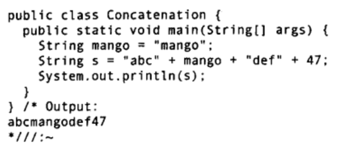
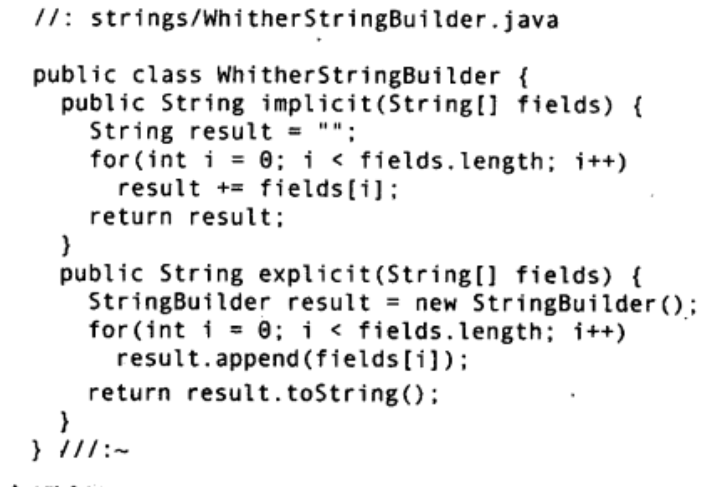
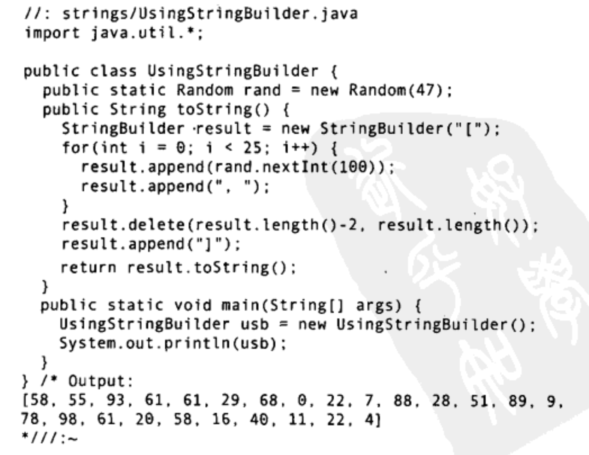
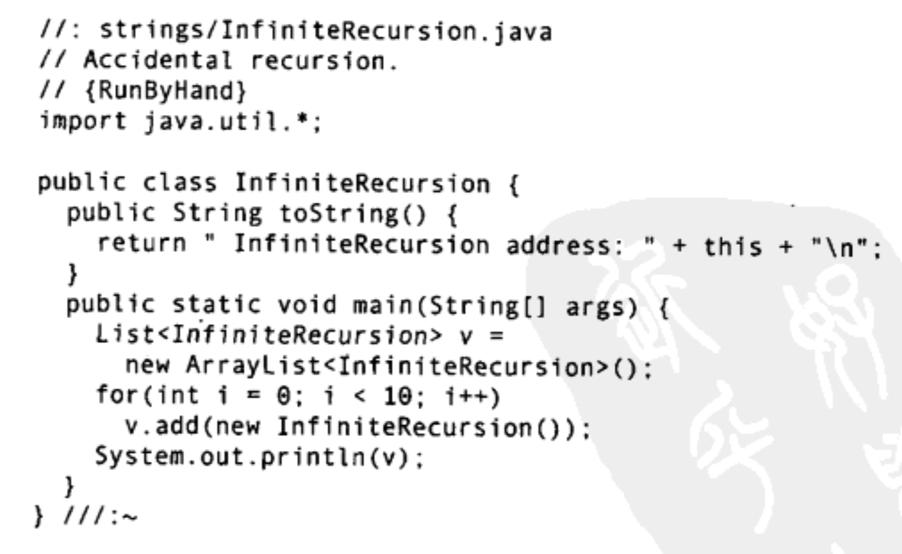
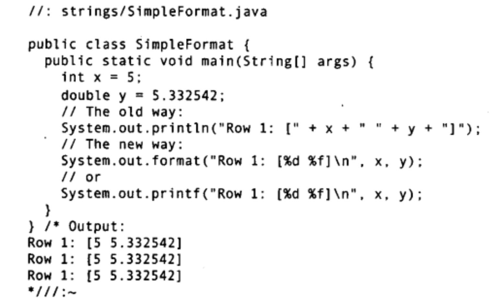
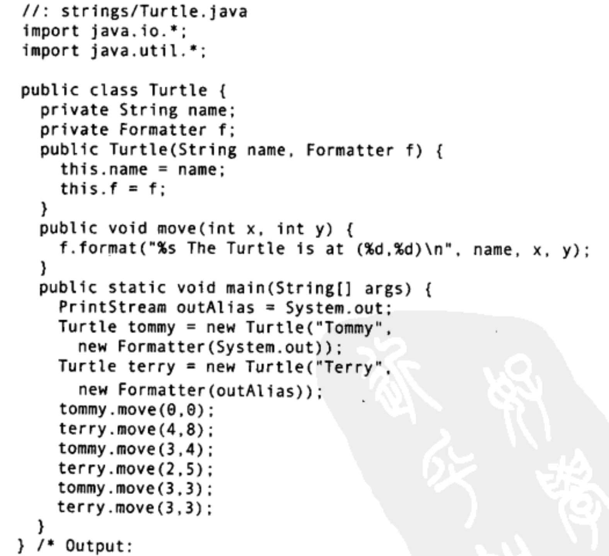
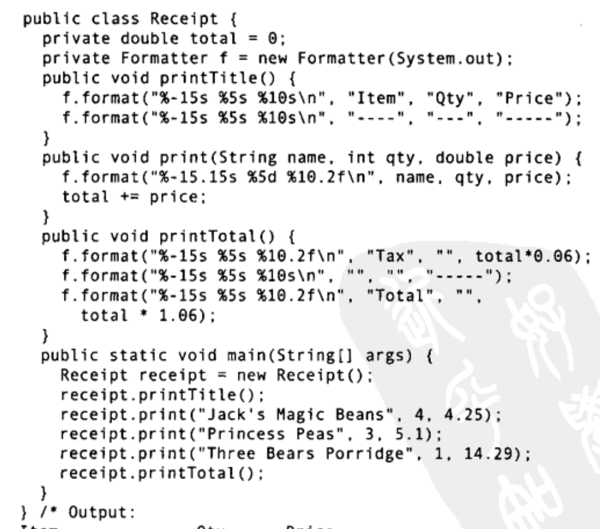
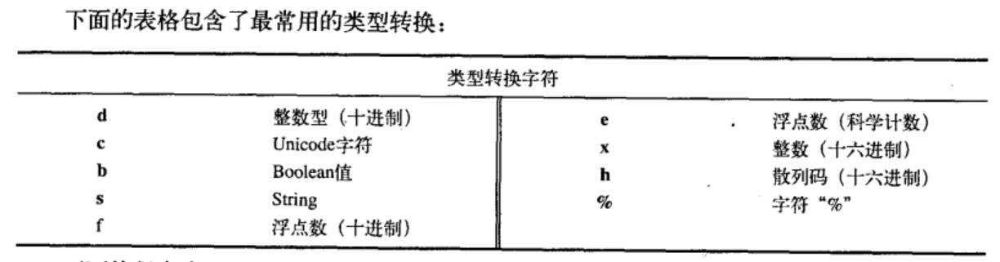
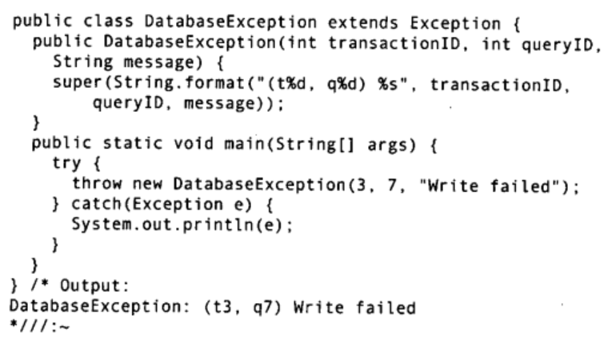

## String 是不可变对象
String对象是不可变的。查看JDK文档你就会发现，String类中每一个看起来会修改String值的方法，实际上都是创建了一个全新的String对象，以包含修改后的字符串内容。而最初的String对象则丝毫未动。这足以说明，upcase()返回的引用已经指向了一个新的对象，而原本的q则还在原地. String的这种行为方式其实正是我们想要的。例如
```java
String s ="asdf";
String x = Immutable.upcase(s);
```
## StringBuilder 与 重载 "+"
不可变性会带来一定的效率问题。为String对象重载的 "+" 操作符就是一个例子。重载的意思是，一个操作符在应用于特定的类时，被赋予了殊的意义 (**用于String的`"+"`与`"+="`是Java中仅有的两个重载过的操作符，而Java并不允许程序员重载任何操作符**)。
操作符“+”可以用来连接String:


想看看以上代码到底是如何工作的吗，可以用JDK自带的工具javap来反编译以上代码。命令如下: `javap -c Concatenation` 这里的-c标志表示将生成JVM字节码。在这个例子中，**编译器创建了一个StringBuilder对象，用以构造最终的String，并为每个字符串调用一次StringBuilder的append()方法，总计四次**。最后调用toString0生成结果，并存为s.
现在，也许你会觉得可以随意使用String对象，反正编译器会为你自动地优化性能。可是在这之前，让我们更深入地看看编译器能为我们优化到什么程度。下面的程序采用两种方式生成一个String:方法一使用了多个String对象;方法二在代码中使用了StringBuilder.


要注意的重点是: 前者StringBuilder是在循环之内构造的，这意味着每经过循环一次，就会创建一个新的StringBuilder对象。后者不仅循环部分的代码更简短、更简单，而且它只生成了一个StringBuilder对象。显式地创建StringBuilder还允许你预先为其指定大小。如果你已经知道最终的字符串大概有多长那预先指定StringBuilder的大小可以避免多次重新分配缓冲。因此，当你为一个类编写toString0方法时，如果字符串操作比较简单，那就可以信赖编译器，它会为你合理地构造最终的字符串结果。但是，如果你要在toString0方法中使用循环，那么最好自己创建一个StringBuilder对象，用它来构造最终的结果。请参考以下示例：


## this 陷阱
Java中的每个类从根本上都是继承自Obiect，标准容器类自然也不例外。因此容器类都有toStrimng0方法，并且覆写了该方法，使得它生成的String结果能够表达容器自身，以及容器所包含的对象。例如ArrayList.toString()，它会遍历ArrayList中包含的所有对象，调用每个元素上的toString()方法. 如果你希望toString()方法打印出对象的内存地址，也许你会考虑使用this关键字. 观察这个程序:


这里发生了自动类型转换，由InfiniteRecursion类型转换成String类型。因为编译器看到-个String对象后面跟着一个“+”，而再后面的对象不是String，**于是编译器试着将this转换成一个String。它怎么转换呢，正是通过调用this上的tString()方法，于是就发生了递归调用。如果你真的想要打印出对象的内存地址，应该调用Object.toString()方法，这才是负责此任务的方法。所以，你不该使用this，而是应该调用super.toString()方法。**
## String上的操作
|方 法|参 数|应 用|
|:-|:-|:-|
|构造器|重载版本:默认版本，String，StringBuilder，StringBuffer，char数组，byte数组|创建String对象
length()||String中字符的个数
charAt()|int索引|取得String中该索引位置上的char
getChars(), getBytes()|要复制部分的起点和终点的索引，复制的目标数组，目标数组的起始索引|复制char或byte到一个目标数组中
toCharArray()||生成一个charl[]，包含String的所有字符
equals()|与之进行比较的String|比较两个String的内容是否相同
equalsIgnoreCase|与之进行比较的String|忽路大小写，如果两个String的内容相同，则返回true
compareTo()|与之进行比较的String|按词典巅序比较String的内容，比较结果为负数、零或正数。注意，大小写并不等价
contains()|要搜索的CharSequence|如果该String对象包含参数的内容，则返回true
contentEquals()|与之进行比较的CharSequence或StringBuffer|如果该String与参数的内容完全一致则返回true|
regionMatcher()|该String的索引偏移，另一个String及其索引偏移量，要比较的长度。重载版本增加了“忽略大小写”功能|返回boolean结果，以表明所比较区城是否相等
startsWith()|可能的起始String。重载版本在参数中增加了偏移量|返回boolean结果，以表明该String是否以此参数起始|
concat()|要连接的String|返回一个新的String对象，内容为原始String连接上参数String
replace()|要替换掉的字符，用来进行替换的新字符。也可以用1个CharSequence来替换另一个CharSequence|返回替换字符后的新String对象。如果没有替换发生，则返回原始的String对象
toLowerCase(), toUpperCase()||将字符的大小写改变后，返回一个新String对象。如果没有改变发生，则返回原始的String对象
trim()||将String两端的空白字符删除后，返回个新的String对象。如果没有改变发生，则返回原始的String对象
valueOf()| 重载版本: Object[]; char[]; char[]，偏移量与字符个数; boolean; char; int;long; float; double
intern()||返回一个表示参数内容的String, 为每个唯一的字符序列生成一个且仅生成一个String引用

## 格式化输出
C风格的格式化占位符控制输出，如下一例


向Java迁移, 使用Formatter类, **在Java中，所有新的格式化功能都由javautil.Formatter类处理。可以将Formatter看作一个翻译器，它将你的格式化字符串与数据翻译成需要的结果。** 当你创建一个Formatter对象的时候，需要向其构造器传递一些信息，告诉它最终的结果将向哪里输出. **Formatter的构造器经过重载可以接受多种输出目的地，不过最常用的还是PrintStream()(如上例)、OutputStream和File**。


### 格式化说明符
在插人数据时，如果想要控制空格与对齐，你需要更精细复杂的格式修饰符。以下是其抽象的语法:
`%[argument_index$][flags][width][.precision]conversion`
最常见的应用是控制一个域的最小尺寸，这可以通过指定width来实现。Formatter对象通过在必要时添加空格，来确保一个域至少达到某个长度。**在默认的情况下，数据是右对齐，不过可以通过使用"-"标志来改变对齐方向。**


与width相对的是precision，它用来指明最大尺寸。width可以应用于各种类型的数据转换，并且其行为方式都一样。precision则不然，不是所有类型的数据都能使用preision，而且，应用于不同类型的数据转换时，precision的意义也不同。在将precision应用于String时，它表示打印String时输出字符的最大数量。而在将precision应用于浮点数时，它表示小数部分要显示出来的位数(默认是6位小数)，如果小数位数过多则舍入，太少则在尾部补零。由于整数没有小数部分，所以**precision无法应用于整数，如果你对整数应用precision，则会触发异常**。
如下图展示了常见的占位符或类型转换


注意，b转换虽然对各种类型都是合法的，但其行为却不-定与你想象的一致。对于boolean基本类型或Boolean对象，其转换结果是对应的true或false。但是，对其他类型的零数，只要该参数不为null，那转换的结果就永远都是true。即使是数字0转换结果依然为true，而这在其他语言中 (包括C)，往往转换为false。所以，将b应用于非布尔类型的对象时请格外小心。
> 请你在java程序中通过控制输出这一个整洁美观的表格

Java SE5也参考了C中的sprintf0方法，以生成格式化的String对象String.format0是一个static方法，它接受与Formatterformat0方法一样的参数，但返回一个String对象。当你只需使用format0方法一次的时候，String.format0用起来很方便。


## 相关文章
[第12章异常](../第12章异常/)