## String 是不可变对象
String对象是不可变的。查看JDK文档你就会发现，String类中每一个看起来会修改String值的方法，实际上都是创建了一个全新的String对象，以包含修改后的字符串内容。而最初的String对象则丝毫未动。这足以说明，upcase()返回的引用已经指向了一个新的对象，而原本的q则还在原地. String的这种行为方式其实正是我们想要的。例如
```java
String s ="asdf";
String x = Immutable.upcase(s);
```
## StringBuilder 与 重载 "+"
不可变性会带来一定的效率问题。为String对象重载的 "+" 操作符就是一个例子。重载的意思是，一个操作符在应用于特定的类时，被赋予了殊的意义 (**用于String的`"+"`与`"+="`是Java中仅有的两个重载过的操作符，而Java并不允许程序员重载任何操作符**)。
操作符“+”可以用来连接String:


想看看以上代码到底是如何工作的吗，可以用JDK自带的工具javap来反编译以上代码。命令如下: `javap -c Concatenation` 这里的-c标志表示将生成JVM字节码。在这个例子中，**编译器创建了一个StringBuilder对象，用以构造最终的String，并为每个字符串调用一次StringBuilder的append()方法，总计四次**。最后调用toString0生成结果，并存为s.
现在，也许你会觉得可以随意使用String对象，反正编译器会为你自动地优化性能。可是在这之前，让我们更深入地看看编译器能为我们优化到什么程度。下面的程序采用两种方式生成一个String:方法一使用了多个String对象;方法二在代码中使用了StringBuilder.


要注意的重点是: 前者StringBuilder是在循环之内构造的，这意味着每经过循环一次，就会创建一个新的StringBuilder对象。后者不仅循环部分的代码更简短、更简单，而且它只生成了一个StringBuilder对象。显式地创建StringBuilder还允许你预先为其指定大小。如果你已经知道最终的字符串大概有多长那预先指定StringBuilder的大小可以避免多次重新分配缓冲。因此，当你为一个类编写toString0方法时，如果字符串操作比较简单，那就可以信赖编译器，它会为你合理地构造最终的字符串结果。但是，如果你要在toString0方法中使用循环，那么最好自己创建一个StringBuilder对象，用它来构造最终的结果。请参考以下示例：


## this 陷阱
Java中的每个类从根本上都是继承自Obiect，标准容器类自然也不例外。因此容器类都有toStrimng()方法，并且覆写了该方法，使得它生成的String结果能够表达容器自身，以及容器所包含的对象。例如ArrayList.toString()，它会遍历ArrayList中包含的所有对象，调用每个元素上的toString()方法. 如果你希望toString()方法打印出对象的内存地址，也许你会考虑使用this关键字. 观察这个程序:


这里发生了自动类型转换，由InfiniteRecursion类型转换成String类型。因为编译器看到-个String对象后面跟着一个“+”，而再后面的对象不是String，**于是编译器试着将this转换成一个String。它怎么转换呢，正是通过调用this上的tString()方法，于是就发生了递归调用。如果你真的想要打印出对象的内存地址，应该调用Object.toString()方法，这才是负责此任务的方法。所以，你不该使用this，而是应该调用super.toString()方法。**
## String上的操作
|方 法|参 数|应 用|
|:-|:-|:-|
|构造器|重载版本:默认版本，String，StringBuilder，StringBuffer，char数组，byte数组|创建String对象
length()||String中字符的个数
charAt()|int索引|取得String中该索引位置上的char
getChars(), getBytes()|要复制部分的起点和终点的索引，复制的目标数组，目标数组的起始索引|复制char或byte到一个目标数组中
toCharArray()||生成一个charl[]，包含String的所有字符
equals()|与之进行比较的String|比较两个String的内容是否相同
equalsIgnoreCase|与之进行比较的String|忽路大小写，如果两个String的内容相同，则返回true
compareTo()|与之进行比较的String|按词典巅序比较String的内容，比较结果为负数、零或正数。注意，大小写并不等价
contains()|要搜索的CharSequence|如果该String对象包含参数的内容，则返回true
contentEquals()|与之进行比较的CharSequence或StringBuffer|如果该String与参数的内容完全一致则返回true|
regionMatcher()|该String的索引偏移，另一个String及其索引偏移量，要比较的长度。重载版本增加了“忽略大小写”功能|返回boolean结果，以表明所比较区城是否相等
startsWith()|可能的起始String。重载版本在参数中增加了偏移量|返回boolean结果，以表明该String是否以此参数起始|
concat()|要连接的String|返回一个新的String对象，内容为原始String连接上参数String
replace()|要替换掉的字符，用来进行替换的新字符。也可以用1个CharSequence来替换另一个CharSequence|返回替换字符后的新String对象。如果没有替换发生，则返回原始的String对象
toLowerCase(), toUpperCase()||将字符的大小写改变后，返回一个新String对象。如果没有改变发生，则返回原始的String对象
trim()||将String两端的空白字符删除后，返回个新的String对象。如果没有改变发生，则返回原始的String对象
valueOf()| 重载版本: Object[]; char[]; char[]，偏移量与字符个数; boolean; char; int;long; float; double
intern()||返回一个表示参数内容的String, 为每个唯一的字符序列生成一个且仅生成一个String引用

## 格式化输出
C风格的格式化占位符控制输出，如下一例


向Java迁移, 使用Formatter类, **在Java中，所有新的格式化功能都由javautil.Formatter类处理。可以将Formatter看作一个翻译器，它将你的格式化字符串与数据翻译成需要的结果。** 当你创建一个Formatter对象的时候，需要向其构造器传递一些信息，告诉它最终的结果将向哪里输出. **Formatter的构造器经过重载可以接受多种输出目的地，不过最常用的还是PrintStream()(如上例)、OutputStream和File**。


### 格式化说明符
在插入数据时，如果想要控制空格与对齐，你需要更精细复杂的格式修饰符。以下是其抽象的语法:
`%[argument_index$][flags][width][.precision]conversion`
最常见的应用是控制一个域的最小尺寸，这可以通过指定width来实现。Formatter对象通过在必要时添加空格，来确保一个域至少达到某个长度。**在默认的情况下，数据是右对齐，不过可以通过使用"-"标志来改变对齐方向。**


与width相对的是precision，它用来指明最大尺寸。width可以应用于各种类型的数据转换，并且其行为方式都一样。precision则不然，不是所有类型的数据都能使用preision，而且，应用于不同类型的数据转换时，precision的意义也不同。在将precision应用于String时，它表示打印String时输出字符的最大数量。而在将precision应用于浮点数时，它表示小数部分要显示出来的位数(默认是6位小数)，如果小数位数过多则舍入，太少则在尾部补零。由于整数没有小数部分，所以**precision无法应用于整数，如果你对整数应用precision，则会触发异常**。
如下图展示了常见的占位符或类型转换


注意，b转换虽然对各种类型都是合法的，但其行为却不-定与你想象的一致。对于boolean基本类型或Boolean对象，其转换结果是对应的true或false。但是，对其他类型的零数，只要该参数不为null，那转换的结果就永远都是true。即使是数字0转换结果依然为true，而这在其他语言中 (包括C)，往往转换为false。所以，将b应用于非布尔类型的对象时请格外小心。

Java SE5也参考了C中的sprintf0方法，以生成格式化的String对象String.format0是一个static方法，它接受与Formatterformat0方法一样的参数，但返回一个String对象。当你只需使用format0方法一次的时候，String.format0用起来很方便。


## Java中的正则化表达式
### 1. 基础
一般来说，正则表达式就是以某种方式来描述字符串，因此你可以说:“如果一个字符串含有这些东西，那么它就是我正在找的东西。”例如，要找一个数字，它可能有一个负号在最前面那你就写一个负号加上一个问号，就像这样:
`-?`
要描述一个整数，你可以说它有一位或多位阿拉伯数字。在正则表达式中，用d表示一位数字。如果在其他语言中使用过正则表达式，那你立刻就能发现Java对反斜线\的不同处理。在其他语言中，\\表示 我想要在正则表达式中插入一个普通的(字面上的)反斜线，请不要给它任何特殊的意义. 然而**在Java中，`\\`的意思是 我要插入一个正则表达式的反斜线**. 例如，如果你想表示一位数字，那么正则表达式应该是`\\d`。如果你想插入一个普通的反斜线，则应该这样`\\\\`。不过换行和制表符之类的东西只需使用单反斜线:`\n`, `\t`。

要表示“一个或多个之前的表达式”，应该使用+。所以，如果要表示“**可能有一个负号后面跟着一位或多位数字**”，可以这样
`-?\\d+`

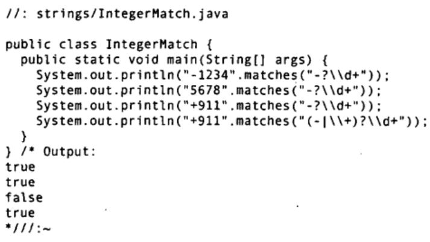

String类还自带了一个非常有用的正则表达式工具-split()方法，其功能是“将字符串从正则表达式匹配的地方切开”

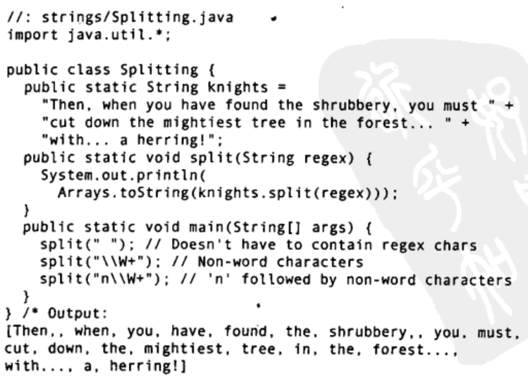

首先看第一个语句，注意这里用的是普通的字符作为正则表达式，其中并不包含任何特殊的字符。因此第一个split()只是按空格来划分字符串。
第二个和第三个split()都用到了\W，它的意思是非单词字符 (如果W小写，\w，则表示个单词字符)。**通过第二个例子可以看到，它将标点字符删除了**。第三个split()表示“字母n后面跟着一个或多个非单词字符。”可以看到，在原始字符串中，与正则表达式匹配的部分，在最终结果中都不存在了。String.split()还有一个重载的版本，它允许你限制字符串分割的次数。

String类自带的最后一个正则表达式工具是“替换”。你可以只替换正则表达式第一个匹配的子串，或是替换所有匹配的地方。
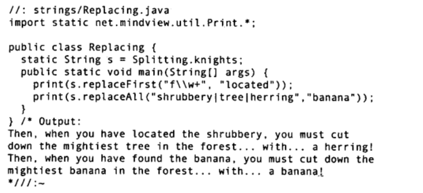
第一个表达式要匹配的是，以字母开头，后面跟一个或多个字母(注意这里的是小写的)。并且只替换掉第一个匹配的部分，所以“found”被替换成“located”。第二个表达式要匹配的是三个单词中的任意一个，因为它们以竖直线分隔表示“或”，并且替换所有匹配的部分。
> (1) 请参考javautilregexPattern的文档编写一个正则表达式，检查一个句子是否以大写字母开头，以号结尾。
> (2)将字符串Splitting.knights在the和you处分割。
> (3)参考javautil.regex,Pattern的文档，用下划线替换Splitting.knights中的所有元音字母。

----

### 2. 创建正则表达式
我们首先从正则表达式可能存在的构造集中选取一个很有用的子集，以此开始学习正则表达式。正则表达式的完整构造子列表，请参考JDK文档java.util.regex包中的Pattern类。

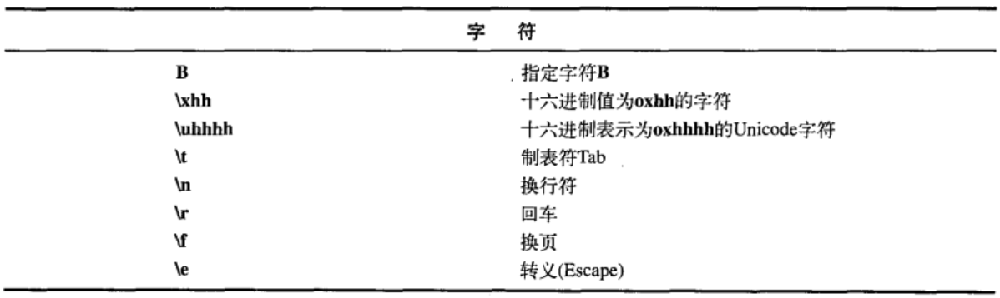

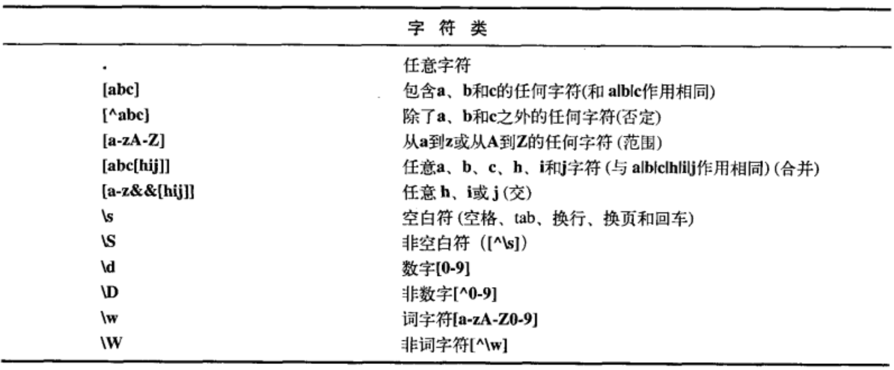

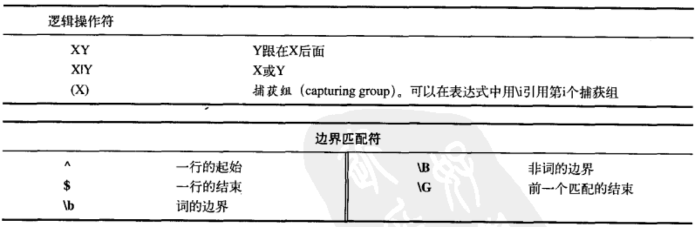

### 3. 量词
量词描述了一个模式吸收输入文本的方式:
* 贪婪型:量词总是贪婪的，除非有其他的选项被设置。贪婪表达式会为所有可能的模式发现尽可能多的匹配。导致此问题的一个典型理由就是假定我们的模式仅能匹配第一个可能的字符组，如果它是贪婪的，那么它就会继续往下匹配。

* 勉强型:用问号来指定，这个量词匹配满足模式所需的最少字符数。因此也称作懒惰的最少匹配的、非贪婪的、或不贪婪的。

* 占有型:目前，这种类型的景词只有在Java语言中才可用 (在其他语言中不可用)，并且也更高级，因此我们大概不会立刻用到它。当正则表达式被应用于字符串时，它会产生相当多的状态，以便在匹配失败时可以回溯。而“占有的”量词并不保存这些中间状态，因此它们可以防止回溯。它们常常用于防止正则表达式失控，因此可以使正则表达式执行起来更有效。
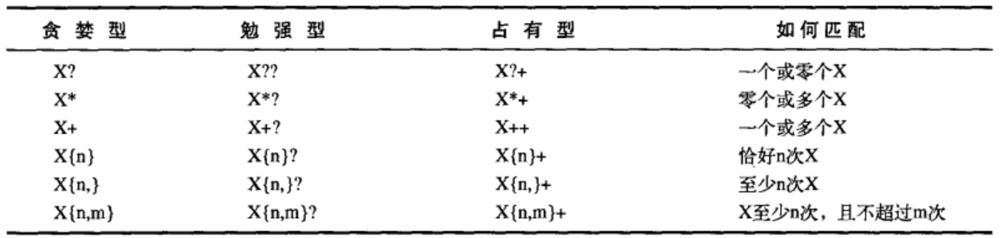

### Pattern & Matcher
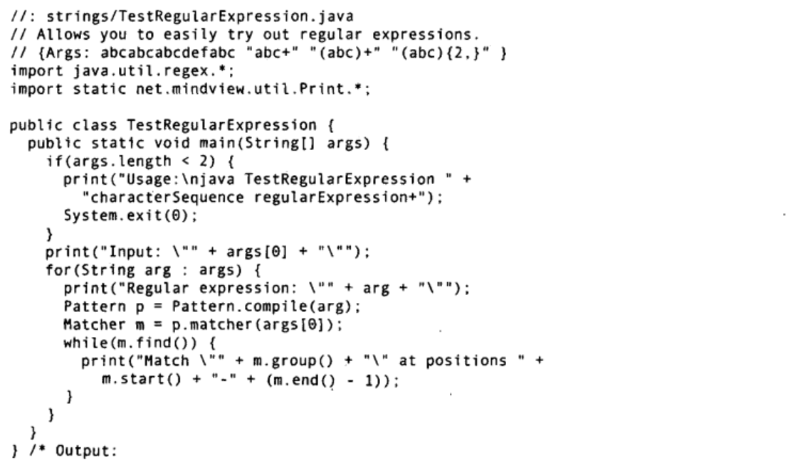
```git
Input: "abcabcabcdefabc"
Regular expression: "abcabcabcdefabc"
Match "abcabcabcdefabc" at positions 0-14
Regular expression: "abc+"
Match "abc" at positions 0-2
Match "abc" at positions 3-5
Match "abc" at positions 6-8
Match "abc" at positions 12-14
Regular expression: "(abc)+"
Match "abcabcabc" at positions 0-8
Match "abc" at positions 12-14
Regular expression:"(abc){2, }"
Match "abcabcabc" at positions 0-8
```

> 1. 对字符串Java now has regular expressions验证下列正则表达式是否能够发现一个匹配:
> ^Java
> \Breg.*
> n.w\s+h(a|i)s
> s?
> s*
> s+
> s{4}
> s{1}
> s{0,3}
> 2. 使用 `(?i)((^[aeiou])|(\s+[aeiou]))\w+?[aeiou]\b` 匹配字符串 `Arline ate eight apples and one orange while Anita hadn't any`


`Matcher.find()`方法可用来在CharSequence中查找多个匹配
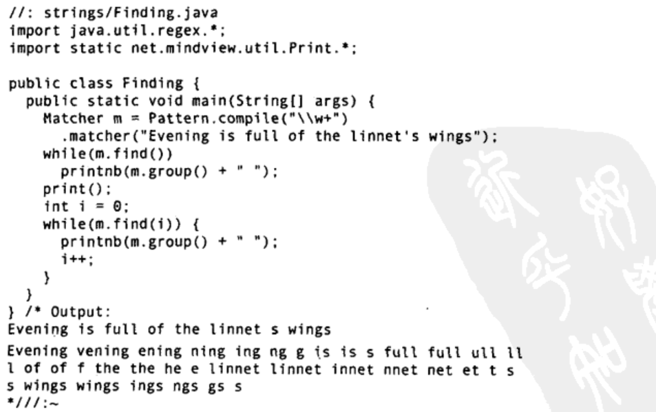

### 组(Groups)
组是用括号划分的正则表达式，可以根据组的编号来引用某个组。组号为0表示整个表达式, 组号1表示被第一对括号括起的组，依此类推。因此，在下面这个表达式，
`A(B(C))D`
中有三个组: **组0是ABCD，组1是BC，组2是C**。Matcher对象提供了一系列方法，用以获取与组相关的信息: 
* `public int groupCount()`返回该匹配器的模式中的分组数目，第0组不包括在内
* `public String group()` 返回前一次匹配操作(例如find())的第0组(整个匹配)。
* `public String group(int i)` 返回在前一次配操作期间指定的组号，如果匹配成功，但是指定的组没有匹配输入字符串的任何部分，则将会返回null.
* `public int start(int group)`返回在前一次匹配操作中寻找到的组的起始索引。
* `public int end(intgroup)`返回在前一次匹配操作中寻找到的组的最后一个字符索引加一的值。

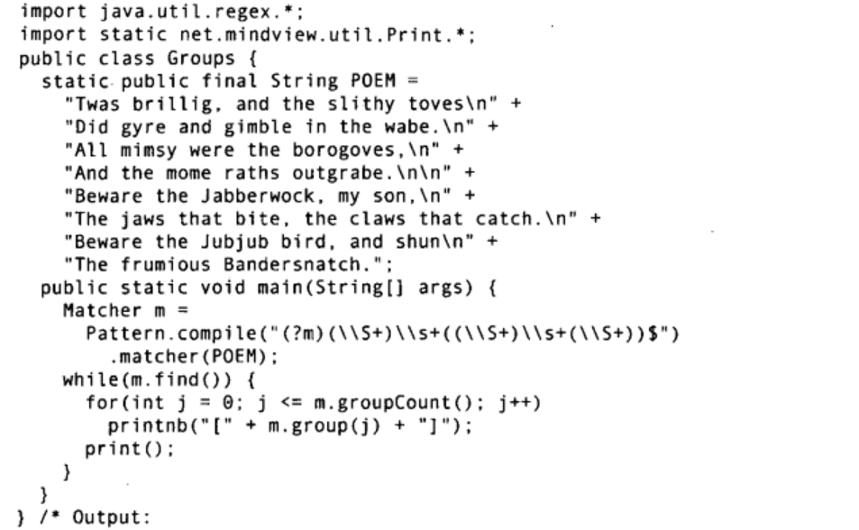
由任意数目的非空格字符 (S+)及随后的任意数目的空格字符 (s+)所组成。目的是捕获每行的最后3个词，每行最后以S结束。不过，在正常情况下是将$与整个输入序列的末端相匹配。所以我们一定要显式地告知正则表达式注意输入序列中的换行符。这可以由序列开头的模式标记(?m)来完成

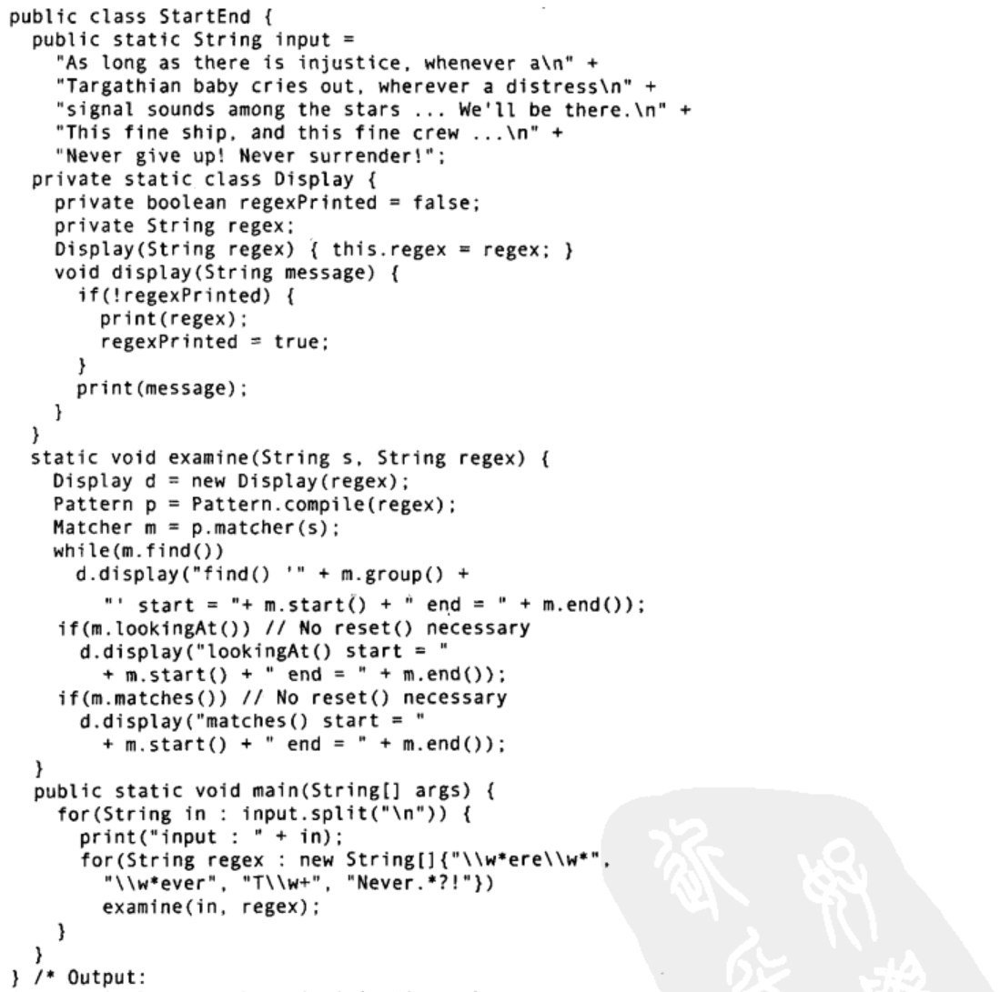
注意，find()可以在输入的任意位置定位正则表达式，而lookingAt()和matches()只有在正则表达式与输入的最开始处就开始匹配时才会成功。matches()只有在整个输入都匹配正则表达式时才会成功，而lookingAt()只要输入的第一部分匹配就会成功
> (1) 修改Goupsjava类，找出所有不以大写字母开头的词，不重复地计算其个数
> (2) 修改StartEnd.java，让它使用Groups.POEM为输入，必要时修改正则表达式使find()、lookingAt()和matches()都有机会匹配成功。

### Pattern标记
Pattern类的compile0方法还有另一个版本，它接受一个标记参数，以调整匹配的行为:
`Pattern Pattern.compile(String regex， int flag)`其中的flag来自以下Patter类中的常量:

|编译标记|说明|
|:-|:-|
Pattern.CANON_EQ|两个字符当且仅当它们的完全规范分解相匹配时，就认为它们是匹配的。例如，如果我们指定这个标记，表达式a\u030A就会匹配字符串?。在默认的情况下，匹配不考虑规范的等价性|
Pattern.CASE_INSENSITIVE(?i)|默认情况下，大小写不敏感的匹配假定只有US-ASCII字符集中的字符才能进行。这个标记允许模式匹配不必考虑大小写 (大写或小写)。通过指定UNICODE_CASE标记及结合此标记，基于Unicode的大小写不敏感的匹配就可以开启了|
Pattern.COMMENTS(?x)|在这种模式下，空格符将被忽略掉，并且以#开始直到行末的注释也会被忽略掉。通过嵌入的标记表达式也可以开启Unix的行模式|
Pattern.DOTALL(?s)|在dotall模式中，表达式"."匹配所有字符，包括行终结符。默认情况下"."表达式不匹配行终结符|
Pattern.MULTILINE(?m)|在多行模式下，表达式“和S分别匹配一行的开始和结束。^还匹配输入字符串的开始，而S还匹配输入字符串的结尾。默认情况下，这些表达式仅匹配输入的完整字符串的开始和结束|
Pattern.UNICODE_CASE(?u)|当指定这个标记，并且开启CASE_INSENSITIVE时，大小写不敏感的匹配将按照与Unicode标准相一致的方式进行。默认情况下，大小写不敏感的匹配假定只能在 US-ASCI字符集中的字符才能进行
Pattern.UNIX_LINES(?d)|在这种模式下，在.^和$行为中，只识别行终结符/n

---

**在这些标记中，Pattern.CASE_INSENSITIVE、Pattern.MULTILINE以及Pattern.COMMENTS(对声明或文档有用)特别有用。请注意，你可以直接在正则表达式中使用其中的大多数标记，只需要将上表中括号括起的字符插入到正则表达式中，你希望它起作用的位置即可。**

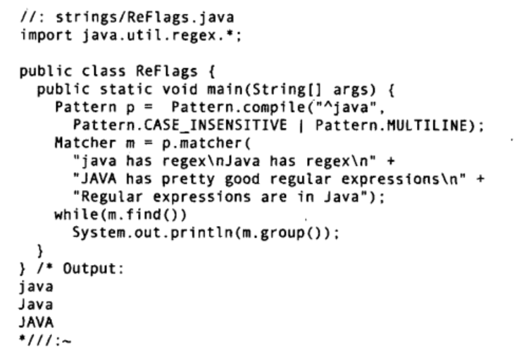

在这个例子中，我们创建了一个模式，它将匹配所有以“java”“Java”和“JAVA”等开头的行并且是在设置了多行标记的状态下，对每一个行 (从字符序列的第一个字符开始，至每一个行终结符)都进行匹配。注意，group0方法只返回已匹配的部分。

### split()
split()方法将输入字符串断开成字符串对象数组，断开边界由下列正则表达式确定:
```java
String[] split(CharSequence fnput)
String[] split(CharSequence input，int limit)
```
这是一个快速而方便的方法，可以按照通用边界断开输入文本:
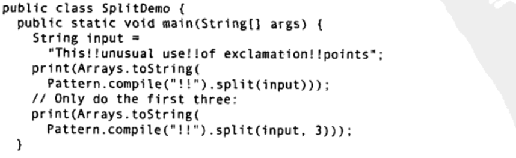

### replace()

正则表达式特别便于替换文本，它提供了许多方法:
* `replaceFirst(String replacement)`以参数字符串replacement替换掉第一个匹配成功的部分。
* `replaceAll(String replacement)`以参数字符串replacement替换所有匹配成功的部分。
* `appendReplacement(StringBuffer sbuf,Stringreplacement)`执行**渐进式的替换**，而不是像replaceFirst()和replaceAll()那样只替换第一个匹配或全部匹配。这是一个非常重要的方法。它允许你调用其他方法来生成或处理replacement(replaceFirst()和replaceAll()则只能使用一个固定的字符串)，使你能够以编程的方式将目标分割成组，从而具备更强大的替换功能。
* `appendTail(StringBuffer sbuf)`，在执行了一次或多次appendReplacement()之后，调用此方法可以将输入字符串余下的部分复制到sbuf中

下面的程序演示了如何使用这些替换方法。开头部分注释掉的文本，就是正则表达式要处理的输入字符串。
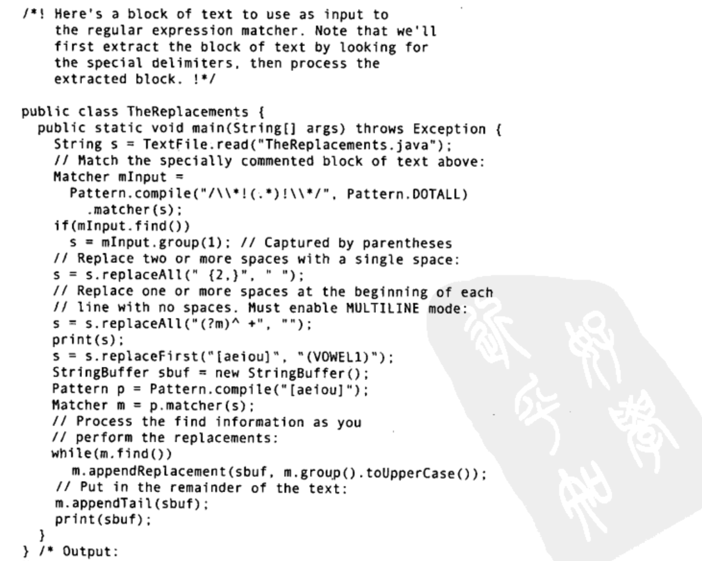

### reset()
通过reset()方法，可以将现有的Matcher对象应用于一个新的字符序列
```java
public class Resetting {
    public static void main(String[] args) {
        Matcher matcher = Pattern.compile("[frb][aiu][gx]").matcher("fix the rug wit bag");
        while(matcher.find())
            System.out.println(matcher.group());
        matcher.reset("new tes fax rag adc");
        while(matcher.find())
            System.out.println(matcher.group());
    }
}
```
使用不带参数的reset()方法，可以将Matcher对象重新设置到当前字符序列的起始位置


## 扫描输入

到目前为止，从文件或标准输入读取数据还是一件相当痛苦的事情。一般的解决之道就是读入一行文本，对其进行分词，然后使用Imteger、Double等类的各种解析方法来解析数据:
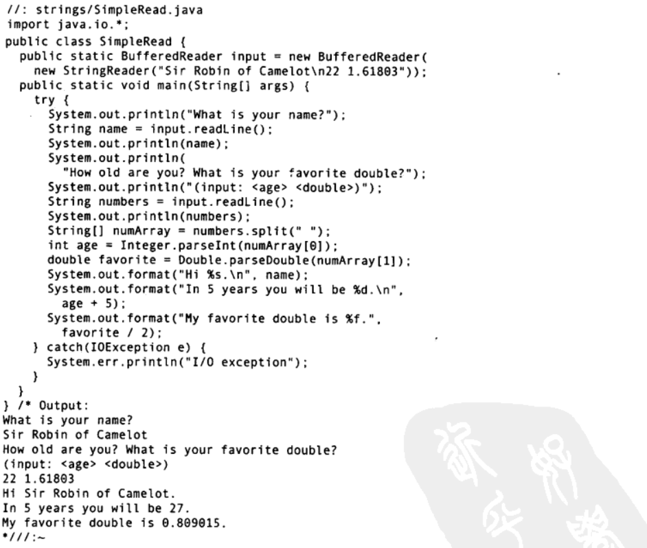
imput元素使用的类来自`java.io`，在第18章中我们会正式介绍这个包中的内容。`StringReader`将String转化为可读的流对象，然后用这个对象来构造BufferReader对象，因为我们要使用`BufferReader`的readLine()方法。最终，我们可以使用input对象一次读取一行文本，就像是从控制台读取标准输入一样。

终于，Java SE5新增了Scanner类，它可以大大减轻扫描输入的工作负担
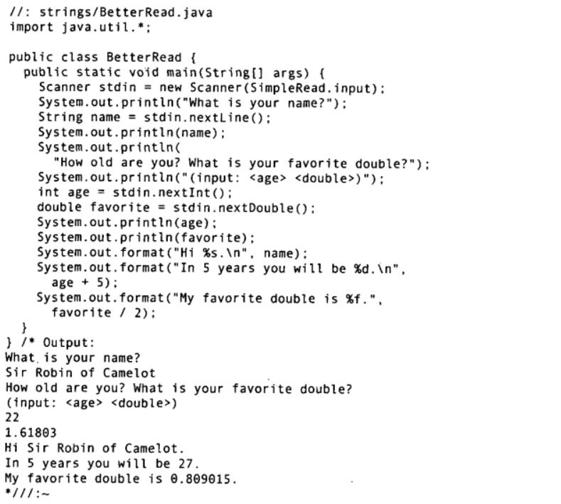

**`Scanner`的构造器可以接受任何类型的输入对象，包括`File对象` (同样，我们将在第18章中详细介绍File类)、`InputStream`、`String`或者像此例中的`Readable`对象。** Readable是Java SE5中新加入的一个接口，表示“具有read()方法的某种东西”。前一个例子中的BufferedReader也归于这一类。有了Scanner，所有的输入、分词以及翻译的操作都**隐藏在不同类型的next方法中**. 普通的next()方法返回下一个String。所有的基本类型(除char之外)都有对应的next方法，包括BigDecimal和BigInteger。所有的next方法，只有在找到一个完整的分词之后才会返回Scanner还有相应的`hasNext`方法，用以判断下一个输入分词是否所需的类型。在前面的两个例子中，一个有趣的区别是，BetterRead.java没有针对IOException添加try区块。因为，**Scanner有一个假设，在输入结束时会抛出IOException，所以Scanner会把IOException吞掉**。不过，通过io.Exception()方法，你可以找到最近发生的异常，因此，你可以在必要时检查它。

### Scanner 定界符
在默认的情况下，Scanner根据空白字符对输入进行分词，但是你可以用正则表达式指定自定义的边界
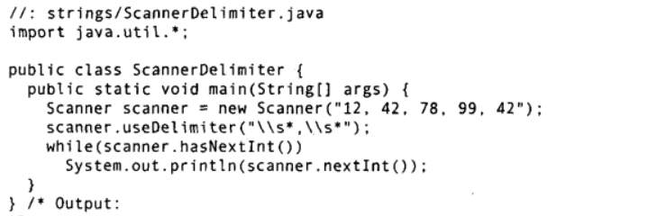
这个例子使用逗号 (包括逗号前后任意的空白字符) 作为定界符，**同样的技术也可以用来读取逗号分隔的文件**。我们可以用`useDelimiter()`来设置定界符，同时，还有一个`delimiter()`方法用来返回当前正在作为定界符使用的Pattern对象。

### 使用正则表达式扫描
除了能够扫描基本类型之外，你还可以使用自定义的正则表达式进行扫描，这在扫描复杂数据的时候非常有用。下面的例子将扫描一个防火墙日志文件中记录的威胁数据:
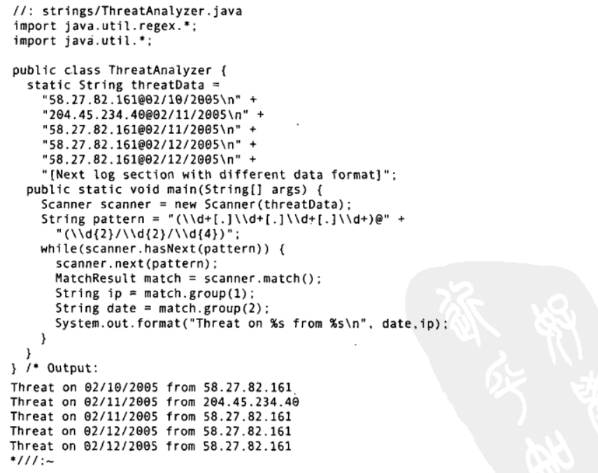

当next()方法配合指定的正则表达式使用时，将找到下一个匹配该模式的输入部分，调用match()方法就可以获得匹配的结果。