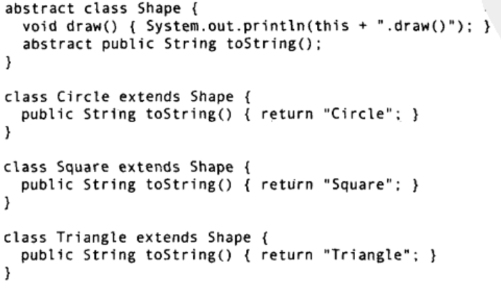

**运行时类型信息**使得你可以在程序运行时发现和使用类型信息。它使你从只能在编译期执行面向类型的操作的禁锢中解脱了出来，并且可以使用某些非常强大的程序。对**RTTI**的需要，揭示了面向对象设计中许多有趣 (并且复杂)的问题，同时也提出了如何组织程序的问题。本章将讨论 Java 是如何让我们在运行时识别对象和类的信息的。主要有两种方式:一种是“传统的”RTTI，它假定我们在编译时已经知道了所有的类型，另一种是“**反射**”机制，它允许我们在运行时发现和使用类的信息。

## 1. 为什么需要RTTI
```Java
// Shapes.java

```


在这个例子中，当把Shape对象放入`List<Shape>`的数组时会向上转型。但在向上转型为Shape的时候也丢失了Shape对象的具体类型。对于数组而言，它们只是Shape类的对象。当从数组中取出元素时，这种容器-一实际上它将所有的事物都当作Object持有---会自将结果转型回Shape。这是RTTI最基本的使用形式，因为在Java中，所有的类型转换都是在运行时进行正确性检查的。**这也是RTTI名字的含义:在运行时，识别一个对象的类型**。

在这个例子中，RTTI类型转换并不彻底:Object被转型为Shape，而不是转型为CircleSquare或者Triangle。这是因为目前我们只知道这个List<Shape>保存的都是Shape。在编译时将由容器和Java的泛型系统来强制确保这一点，而在运行时，由类型转换操作来确保这一点。接下来就是多态机制的事情了，Shape对象实际执行什么样的代码，是由引用所指向的具体对象Circle、Square或者Triangle而决定的。

但是，假如你碰到了一个特殊的编程问题一-如果能够知道某个泛化引用的确切类型，就可以使用最简单的方式去解决它，那么此时该怎么办呢?例如，假设我们允许用户**将某一具体类型的几何形状全都变成某种特殊的颜色，以突出显示它们**。通过这种方法，用户就能找出屏幕上所有被突出显示的三角形。或者，可能要用某个方法来旋转列出的所有图形，但想跳过圆形，因为对圆形进行旋转没有意义。使用RTTI，可以查询某个Shape引用所指向的对象的确切类型，然后选择或者剔除特例.

## 2. class 对象
要理解RTTI在Java中的工作原理，首先必须知道**类型信息在运行时是如何表示**的。这项工作是由称为**Class对象**的特殊对象完成的，**它包含了与类有关的信息**。事实上，Class对象就是用来创建类的所有的“常规”对象的。Java使用Class对象来执行其RTTI，即使你正在执行的是类似转型这样的操作。Class类还拥有大量的使用RTTI的其他方式。类是程序的一部分，每个类都有一个Class对象。换言之，每当编写并且编译了一个新类就会产生一个Class对象 (更恰当地说，是被保存在一个**同名的class文件**中)。为了生成这个类, 类加载器子系统实际上可以包含一条类加载器链，但是只有一个`原生类加载器`，它是JVM实现的一部分。原生类加载器加载的是所谓的可信类，包括Java API类，它们通常是从本地盘加载的。在这条链中，通常不需要添加额外的类加载器，但是如果你有特殊需求(例如以某种特殊的方式加载类，以支持Web服务器应用，或者在网络中下载类)，那么你有一种方式可以挂接额外的类加载器。所有的类都是在对其第一次使用时，动态加载到JVM中的。

当程序创建第一个对类的静态成员的引用时，就会加载这个类。这个证明构造器也是类的静态方法，即使在构造器之前并没有使用static关键字。因此，使用new操作符创建类的新对象也会被当作对类的静态成员的引用。因此，**Java程序在它开始运行之前并非被完全加载**，其各个部分是在必需时才加载的。这一点与许多传统语言都不同。动态加载使能的行为，在诸如C++这样的静态加载语言中是很难或者根本不可能复制的。**类加载器首先检查这个类的Class对象是否已经加载**。如果尚未加载，默认的类加载器就会**根据类名查找.class文件**(例如，某个附加类加载器可能会在数据库中查找字节码)。在这个类的字节码被加载时，它们会接受验证，以确保其没有被破坏，并且不包含不良Java代码(这是Java中用于安全防范目的的措施之一)一旦某个类的Cass对象被裁入内存，它就被用来创建这个类的所有对象。下面的示范程序可以证明这一点:
```java
// SweetShop.java

```


这个方法是Class类(所有Class对象都属于这个类)的一个static成员。Class对象就和其他对象一样，我们可以获取并操作它的引用(这也就是类加器的工作)forName()是取得Class对象的引用的一种方法。它是用一个包含目标类的文本名(注拼写和大小写)的String作输人参数，返回的是一个Class对象的引用，上面的代码忽略了返回值。对forName()的调用是为了它产生的“副作用`如果类Gum还没有被加载就加载它`。在加载的过程中，Gum的static子句被执行。
在前面的例子里，如果Class.forName()找不到你要加载的类，它会抛出异常ClassNotFoundException。这里我们只需简单报告问题，但在更严密的程序里，可能要在异常处理程序中解决这个问题。
无论何时，只要你想在运行时使用类型信息，就必须首先获得对恰当的Class对象的引用Class.forName()就是实现此功能的便捷途径，因为你不需要为了获得Class引用而持有该类型的对象。但是，如果你已经拥有了一个感兴趣的类型的对象，那就可以通过调用`getClass()`方法来获取Class引用了，这个方法属于根类Object的一部分，它将返回表示该对象的实际类型的Class引用。Class包含很多有用的方法，下面是其中的一部分:
```java
// ToyTest.java
```


printInfo()使用`getName()`来产生全限定的类名，并分别使用`getSimpleName()`和`getCanonicalName()`(在Java SE5中引的)来产生不含包名的类名和全限定的类名。`isInterface()`方法如同其名，可以告诉你这个Class对象是否表示某个接口。因此，通过Class对象，你可以发现你想要了解的类型的所有信息。
在main0中调用的`Class.getInterfaces()`方法返回的是Class对象，它们表示在感兴趣的CIass对象中所包含的接口。
如果你有一个Class对象，还可以使用`getSuperclass()`方法查询其直接基类，这将返回你可以用来进一步查询的Class对象。因此，你可以在运行时发现一个对象完整的类继承结构Class的`newInstance()`方法是实现“虚拟构造器”的一种途径，虚拟构造器允许你声明“我不知道你的确切类型，但是论如何要正确地创建你自己。”在前面的示例中，u仅仅只是个Class引用，在编译期不具备任何更进一步的类型信息。当你创建新实例时，会得到Object引用，但是这个引用指向的是Toy对象。当然，在你可以发送Obiect能够接受的消息之外的任何消息之前，你必须更多地了解它，并执行某种转型。另外，使用newInstance()来创建的类，必须带有默认的构造器。在本章稍后部分，你将会看到如何通过使用Java的反射API，用任意的构造器来动态地创建类的对象。
```java
// 练习1:(1)在ToyTest.java中，将Toy的默认构造器注释掉，并解释发生的现象
/*
将Rhomboid(菱形)加Shapes.java中。创建一个Rhomboid，将其向上转型为Shape，然后向下转型回Rhomboid。试着将其向下转型成Circle，看看会发生什么。练习4:(2)修改前一个练习，让你的程序在执行向下转型之前先运用instanceof检查类型练习5:(3)实现Shapesjava中的rotate(Shape)方法，让它能判断它所旋转的是不是Circle
(如果是，就不执行)。练习6:(4)修改Shapesjava，使这个程序能将某个特定类型的所有形状都“标示”出来(通过设标志)。每一个导出的Shape类的toString0方法应该更够指出Shape是否被标示。练习7:(3)修改SweetShop,java，使每种类型对象的创建由命令行参数控制。即，如果命令行是“java SweetShop Candy”，那么只有Candy对象被创建。注意你是如何通过命令行参数来控制加载哪个Class对象的。
练习8:(5)写一个方法，令它接受任意对象作为参数，并能够递归打印出该对象所在的继承体系中的所有类。
练习9:(5)修改前一个练习，让这个方法使用ClassgetDeclaredFields0来打印一个类中的域的相关信息。
练习10:(3)写一个程序，使它能判断char数组究竟是个基本类型，还是一个对象。
*/
```

